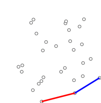
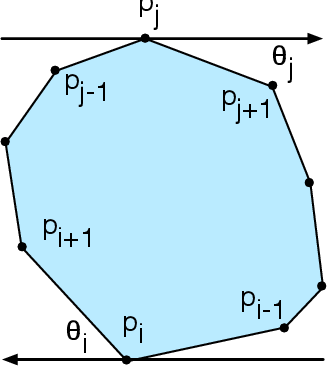
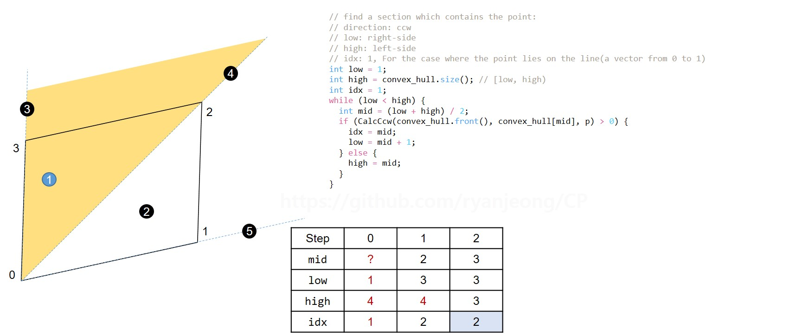
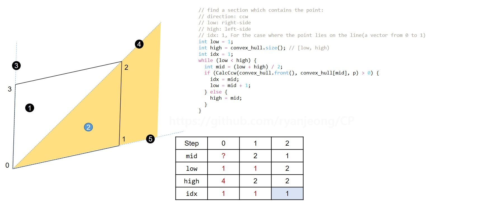
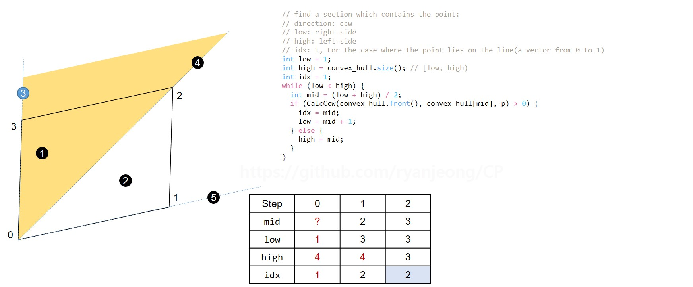
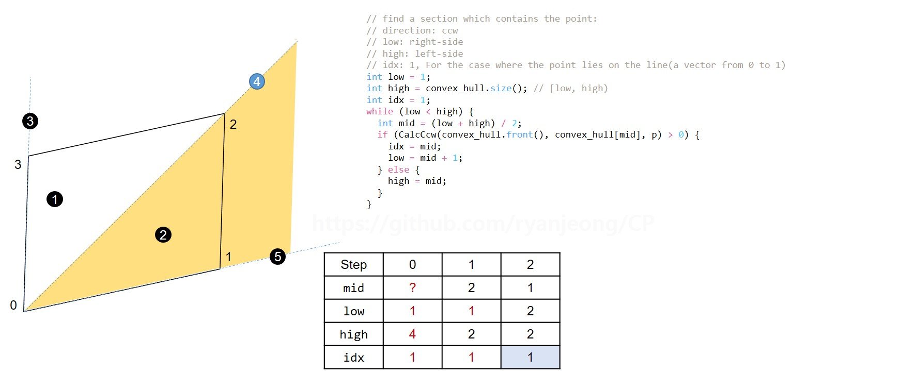
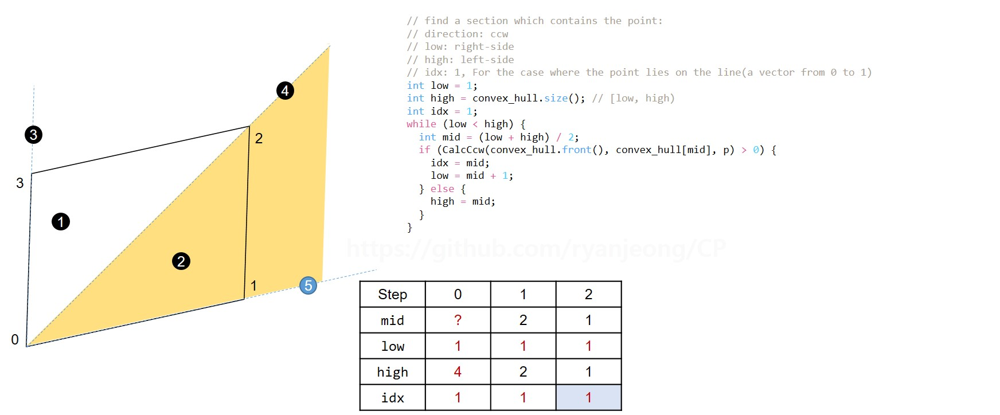

# Convex Hull
* 추천 문제 - Convex Hull
  * [[BOJ] Convex Hull of Lattice Points](https://www.acmicpc.net/problem/2699) [(소스코드)](./src/convex_hull_of_lattice_points.cc) - Convex Hull 동작 방식 이해를 바탕으로 응용하는 문제
  * [[BOJ] Building the Moat](https://www.acmicpc.net/problem/6194) [(소스코드)](./src/building_the_moat.cc) - Convex Hull 알고리즘을 사용해 구한 다각형의 둘레를 계산하는 문제(1)
  * [[BOJ] Wall construction](https://www.acmicpc.net/problem/10903) [(소스코드)](./src/wall_construction.cc) - Convex Hull 알고리즘을 사용해 구한 다각형의 둘레를 계산하는 문제(2)
  * [[BOJ] Wall](https://www.acmicpc.net/problem/7420) [(소스코드)](./src/wall.cc) - Convex Hull 알고리즘을 사용해 구한 다각형의 둘레를 계산하는 문제(3) (반올림 주의)
  * [[BOJ] Cows](https://www.acmicpc.net/problem/6850) [(소스코드)](./src/cows.cc) - Convex Hull 알고리즘을 사용해 구한 다각형의 둘레를 계산하는 문제(4)
---

* 추천 문제 - Rotating Calipers
  * [[BOJ] Robert Hood](https://www.acmicpc.net/problem/9240) [(소스코드)](./src/robert_hood.cc) - 회전하는 캘리퍼스를 사용해 가장 먼 두 점 계산(1)
  * [[BOJ] Squares](https://www.acmicpc.net/problem/8927) [(소스코드)](./src/squares.cc) - 회전하는 캘리퍼스를 사용해 가장 먼 두 점 계산(2)
  * [[BOJ] Highway](https://www.acmicpc.net/problem/10254) [(소스코드)](./src/highway.cc) - 회전하는 캘리퍼스를 사용해 가장 먼 두 점 계산(3)
  * [[BOJ] 달리기 코스](https://www.acmicpc.net/problem/1310) [(소스코드)](./src/course.cc) - 회전하는 캘리퍼스를 사용해 가장 먼 두 점 계산(4)
  * [[BOJ] Breaking Biscuits](https://www.acmicpc.net/problem/15028) [(소스코드)](./src/breaking_biscuits.cc) - 회전하는 캘리퍼스 + 점과 벡터 간 최단경로 계산 

---

* 추천 문제 - Point in Convex Polygon
  * [[BOJ] JABUKE](https://www.acmicpc.net/problem/2987) [(소스코드)](./src/jabuke.cc) - 삼각형 내 점의 존재 유무 판별 문제
  * [[BOJ] 미스테리 싸인](https://www.acmicpc.net/problem/20670) [(소스코드)](./src/m_sign.cc) - 다각형 내 점의 존재 유무 판별 문제
  * [[WIP][BOJ] Separate Points](https://www.acmicpc.net/problem/3878) [(소스코드)](./src/separate_points.cc) - 다각형 내 점의 존재 유무 판별 문제 + 선분 교차 판정

---

## Convex Hull
1. 2차원 평면 상에 좌표 <i>x</i>, <i>y</i>가 주어질 때, <i>y</i> 좌표를 기준으로 오름차순 정렬하되, <i>y</i> 좌표가 동일하다면 <i>x</i> 좌표를 기준으로 오름차순 정렬한다.
2. 기준 좌표(보통 0 번째 index를 기준으로 정함)를 기준으로 반시계 방향으로 정렬한다:
  * [CCW](#ccwcounterclockwise) 알고리즘을 사용했을 때 양수는 반시계 방향, 음수는 시계 방향을 나타냄
  * 만약 0이 나온다면, 기준 좌표로부터 가까운 거리 순으로 정렬
3. [Graham's Scan](https://en.wikipedia.org/wiki/Graham_scan)을 사용해 외곽 좌표를 찾는다:

   

### 연습문제
* [[BOJ] 볼록 껍질](https://www.acmicpc.net/problem/1708) [(소스코드)](./src/convex_hull.cc)
```c++
#include <iostream>
#include <vector>
#include <utility>
#include <algorithm>

// iostream
using std::cin;
using std::cout;

// vector
using std::vector;

// utility
using std::pair;

// algorithm
using std::sort;

pair<int, int> starting_point;

bool CmpCoor(const pair<int, int>&,
             const pair<int, int>&);
bool CmpCcw(const pair<int, int>&,
            const pair<int, int>&);
int64_t CalcCcw(const pair<int, int>&,
                const pair<int, int>&,
                const pair<int, int>&);
int64_t CalcSqDist(const pair<int, int>&,
                   const pair<int, int>&);

int main() {
  int n;
  cin >> n;
  vector<pair<int, int>> v(n);
  for (int i = 0; i < n; ++i)
    cin >> v[i].first >> v[i].second;

  // find the point with the lowest y-coordinate. (v[0], starting_point)
  sort(v.begin(), v.end(), CmpCoor);
  starting_point = v.front();
  // the set of points must be sorted in increasing order of the angle they and
  // the point P make with the x-axis
  sort(v.begin() + 1, v.end(), CmpCcw);

  // Graham's scan
  vector<pair<int, int>> convex_hull;
  for (const auto& p : v) {
    while (convex_hull.size() >= 2) {
      if (CalcCcw(convex_hull[convex_hull.size()-2], convex_hull.back(), p) > 0)
        break;
      convex_hull.pop_back();
    }
    convex_hull.push_back(p);
  }
  cout << convex_hull.size();

  return 0;
}

bool CmpCoor(const pair<int, int>& s,
             const pair<int, int>& t) {
  if (s.second < t.second)
    return true;

  if (s.second == t.second && s.first < t.first)
    return true;

  return false;
}

bool CmpCcw(const pair<int, int>& s,
            const pair<int, int>& t) {
  int64_t res = CalcCcw(starting_point, s, t);

  if (res)
    return res > 0;  // ccw : true, cw : false

  // res = 0
  int64_t dist1 = CalcSqDist(s, starting_point);
  int64_t dist2 = CalcSqDist(t, starting_point);

  return dist1 < dist2;
}

// ccw         : pos.
// on the line : 0
// cw          : neg.
int64_t CalcCcw(const pair<int, int>& a,
                const pair<int, int>& b,
                const pair<int, int>& c) {
  int64_t u1 = b.first - a.first;
  int64_t v1 = b.second - a.second;
  int64_t u2 = c.first - a.first;
  int64_t v2 = c.second - a.second;

  return u1 * v2 - u2 * v1;
}

int64_t CalcSqDist(const pair<int, int>& s,
                   const pair<int, int>& t) {
  int64_t diff_x = s.first - t.first;
  int64_t diff_y = s.second - t.second;

  return diff_x * diff_x + diff_y * diff_y;
}

```

## Rotating Calipers
1. 컨벡스 헐을 통해 외각 점들을 구한다.
2. x축을 기준으로 가장 왼편에 위치하는 점과 가장 오른편에 위치하는 점을 구한다.
  * `0, 1, ..., idx_l, idx_l+1, ..., idx_r, idx_r+1, ...`
3. 2번 과정을 통해 구한 두 점 간 거리를 계산한다.
4. 가장 왼편 벡터(`idx_l+1 - idx_l`)와 가장 오른편 벡터(`idx_r - idx_r+1`)를 사용해 기준 벡터(최초의 기준 벡터는 x축 법선벡터)와의 각을 계산한 뒤, 각이 더 작은 방향으로 탐색을 진행한다.
  1. 만약 기준 벡터와 왼편 벡터 사이의 각이 더 작았을 경우, 왼편 벡터는 `idx_l+2 - idx_l+1`로 갱신되며, 기준 벡터는 `idx_l+1 - idx_l`로 갱신
  2. 만약 기준 벡터와 오른편 벡터 사이의 각이 더 작았을 경우, 오른편 벡터는 `idx_r-1 - idx_r`로 갱신되며, 기준 벡터는 `idx_r - idx_r+1`로 갱신
5. 4번 과정을 통해 외각 점들로 구성된 도형의 변 수만큼 진행한다.

* 위 과정의 문제점:
  * 기준 벡터와 대상 벡터와의 각을 계산하는 과정의 결과는 `double`이며, 이는 <b>실수범위 오차가 발생해 결과가 잘못 나올 수 있음</b>
  * 두 벡터의 외적을 사용하면 결과는 정수형이며, 오차 발생에 의한 잘못된 결과를 예방할 수 있음
  * 기준 벡터와의 각을 구하고자 하는 두 벡터 간 외적 결과를 통해 기준 벡터와의 각이 더 작은 벡터를 계산할 수 있음:
    * 왼편 벡터를 `i`, 오른편 벡터를 `j`이라고 한다면, 두 벡터의 외적 결과가 양수일 때 `i` 벡터를, 두 벡터의 외적 결과가 음수일 때 `j` 벡터를 갱신

    
  
  * 위 방법을 사용할 경우 두 벡터의 외적 결과에 따른 벡터 갱신만 진행하면 되며, 기준 벡터의 갱신은 필요하지 않음

* 작은 각을 기준으로 벡터를 갱신하는 이유는, 큰 각을 기준으로 벡터를 갱신할 경우 두 벡터 중 하나가 기준 벡터를 기준으로 <b>음각</b>이 나올 수 있음

### 연습문제
* [[BOJ] 가장 먼 두 점](https://www.acmicpc.net/problem/2049) [(소스코드)](./src/dist.cc)
```c++
#include <iostream>
#include <vector>
#include <utility>
#include <algorithm>

// iostream
using std::cin;
using std::cout;

// vector
using std::vector;

// utility
using std::pair;

// algorithm
using std::sort;

pair<int, int> starting_point;

bool CmpCoor(const pair<int, int>&,
             const pair<int, int>&);
bool CmpCcw(const pair<int, int>&,
            const pair<int, int>&);
int64_t CalcCcw(const pair<int, int>&,
                const pair<int, int>&,
                const pair<int, int>&);
int64_t CalcSqDist(const pair<int, int>&,
                   const pair<int, int>&);

int main() {
  int n;
  cin >> n;
  vector<pair<int, int>> v(n);
  for (int i = 0; i < n; ++i)
    cin >> v[i].first >> v[i].second;

  // find the point with the lowest y-coordinate. (v[0], starting_point)
  sort(v.begin(), v.end(), CmpCoor);
  starting_point = v.front();
  // the set of points must be sorted in increasing order of the angle they
  // and the point P make with the x-axis
  sort(v.begin() + 1, v.end(), CmpCcw);

  // Graham's scan
  vector<pair<int, int>> convex_hull;
  for (const auto& p : v) {
    while (convex_hull.size() >= 2) {
      if (CalcCcw(convex_hull[convex_hull.size()-2], convex_hull.back(), p) > 0)
        break;
      convex_hull.pop_back();
    }
    convex_hull.push_back(p);
  }

  // Rotating calipers
  int left_i = 0;
  int right_i = 0;
  int n_edge = convex_hull.size();
  for (int i = 0; i < n_edge; ++i) {
    if (convex_hull[i].first < convex_hull[left_i].first)
      left_i = i;
    if (convex_hull[i].first > convex_hull[right_i].first)
      right_i = i;
  }

  int64_t longest_dist = CalcSqDist(convex_hull[left_i], convex_hull[right_i]);
  pair<int, int> left_coor = convex_hull[left_i];
  pair<int, int> right_coor = convex_hull[right_i];
  pair<int, int> origin = { 0, 0 };
  for (int i = 0; i < n_edge; ++i) {
    pair<int, int> left_vector = {
      convex_hull[(left_i + 1)%n_edge].first - convex_hull[left_i].first,
      convex_hull[(left_i + 1)%n_edge].second - convex_hull[left_i].second
    };
    pair<int, int> right_vector = {
      convex_hull[right_i].first - convex_hull[(right_i + 1)%n_edge].first,
      convex_hull[right_i].second - convex_hull[(right_i + 1)%n_edge].second
    };

    if (CalcCcw(origin, left_vector, right_vector) > 0)
      left_i = (left_i + 1) % n_edge;
    else
      right_i = (right_i + 1) % n_edge;

    if (longest_dist < CalcSqDist(convex_hull[left_i], convex_hull[right_i])) {
      longest_dist = CalcSqDist(convex_hull[left_i], convex_hull[right_i]);
      left_coor = convex_hull[left_i];
      right_coor = convex_hull[right_i];
    }
  }
  cout << longest_dist;

  return 0;
}

bool CmpCoor(const pair<int, int>& s,
             const pair<int, int>& t) {
  if (s.second < t.second)
    return true;

  if (s.second == t.second && s.first < t.first)
    return true;

  return false;
}

bool CmpCcw(const pair<int, int>& s,
            const pair<int, int>& t) {
  int64_t res = CalcCcw(starting_point, s, t);

  if (res)
    return res > 0;  // ccw : true, cw : false

  // res = 0
  int64_t dist1 = CalcSqDist(s, starting_point);
  int64_t dist2 = CalcSqDist(t, starting_point);

  return dist1 < dist2;
}

// ccw         : pos.
// on the line : 0
// cw          : neg.
int64_t CalcCcw(const pair<int, int>& a,
                const pair<int, int>& b,
                const pair<int, int>& c) {
  int64_t u1 = b.first - a.first;
  int64_t v1 = b.second - a.second;
  int64_t u2 = c.first - a.first;
  int64_t v2 = c.second - a.second;

  return u1 * v2 - u2 * v1;
}

int64_t CalcSqDist(const pair<int, int>& s,
                   const pair<int, int>& t) {
  int64_t diff_x = s.first - t.first;
  int64_t diff_y = s.second - t.second;

  return diff_x * diff_x + diff_y * diff_y;
}

```

## Point in Convex Polygon
1. 컨벡스 헐을 통해 외각 점들을 구한다.
2. 점이 컨벡스 헐 내에 존재하는지 판별한다:

    0. <b>모든 벡터의 기준점은 컨벡스 헐의 `0`번 좌표이다.</b>
    1. 임의의 점이 가장 오른편 벡터와의 외적 결과가 음수라면, 해당 점은 도형 외부에 있는 것이다.
    2. 임의의 점이 가장 왼편 벡터와의 외적 결과가 양수라면, 해당 점은 도형 외부에 있는 것이다.
    3. 이분탐색을 통해 점이 위치할 수 있는 영역을 찾는다. 만약 컨벡스 헐의 개수가 `n`개라면, 이분탐색의 범위는 `[1, n)`이 된다.
    4. 임의의 점이 위치할 수 있는 영역을 발견했다면, `convex_hull[idx], p, convex_hull[idx+1]` 세 점에 대해 외적한다:
        1. 외적 결과가 양수라면 해당 점은 도형 외부에 있는 것이다.
        2. 외적 결과가 양수라면 해당 점은 도형 내부에, 0이라면 해당 점은 도형 경계에 걸처있는 것이다.

    
    
    
    
    

### 연습문제
* [[BOJ] JABUKE](https://www.acmicpc.net/problem/2987) [(소스코드)](./src/jabuke.cc)
```c++
/*
  Copyright 2022 Ryan M. Jeong <ryan.m.jeong@hotmail.com>
*/

// CP
#define CP do {                     \
  std::ios::sync_with_stdio(false); \
  std::cin.tie(NULL);               \
} while (0)

#include <iostream>
#include <vector>
#include <utility>
#include <algorithm>

// iostream
using std::cin;
using std::cout;
using std::fixed;

// vector
using std::vector;

// utility
using std::pair;

// algorithm
using std::sort;

pair<int, int> starting_point;

bool CmpCoor(const pair<int, int>&,
             const pair<int, int>&);
bool CmpCcw(const pair<int, int>&,
            const pair<int, int>&);
int64_t CalcCcw(const pair<int, int>&,
                const pair<int, int>&,
                const pair<int, int>&);
int64_t CalcSqDist(const pair<int, int>&,
                   const pair<int, int>&);
int64_t PointInPolygon(const vector<pair<int, int>>& convex_hull,
                       const pair<int, int>&);

int main() {
  CP;

  int n = 3;
  vector<pair<int, int>> v(n);
  for (auto& i : v)
    cin >> i.first >> i.second;

  // find the point with the lowest y-coordinate. (v[0], starting_point)
  sort(v.begin(), v.end(), CmpCoor);
  starting_point = v.front();
  // the set of points must be sorted in increasing order of the angle they and
  // the point P make with the x-axis
  sort(v.begin() + 1, v.end(), CmpCcw);

  // Graham's scan
  vector<pair<int, int>> convex_hull;
  for (const auto& p : v) {
    while (convex_hull.size() >= 2) {
      if (CalcCcw(convex_hull[convex_hull.size()-2], convex_hull.back(), p) > 0)
        break;
      convex_hull.pop_back();
    }
    convex_hull.push_back(p);
  }

  int m;
  cin >> m;
  // Determine if a point is inside a polygon
  int cnt = 0;
  while (m--) {
    static pair<int, int> p;
    cin >> p.first >> p.second;
    if (PointInPolygon(convex_hull, p) > 0)
      continue;
    ++cnt;
  }
  cout << fixed;
  cout.precision(1);
  cout << static_cast<double>(CalcCcw(
      convex_hull[0], convex_hull[1], convex_hull[2])) / 2 << '\n';
  cout << cnt;

  return 0;
}

bool CmpCoor(const pair<int, int>& s,
             const pair<int, int>& t) {
  if (s.second < t.second)
    return true;

  if (s.second == t.second && s.first < t.first)
    return true;

  return false;
}

bool CmpCcw(const pair<int, int>& s,
            const pair<int, int>& t) {
  int64_t res = CalcCcw(starting_point, s, t);

  if (res)
    return res > 0;  // ccw : true, cw : false

  // res = 0
  int64_t dist1 = CalcSqDist(s, starting_point);
  int64_t dist2 = CalcSqDist(t, starting_point);

  return dist1 < dist2;
}

/* ccw         : pos.
   on the line : 0
   cw          : neg. */
int64_t CalcCcw(const pair<int, int>& a,
                const pair<int, int>& b,
                const pair<int, int>& c) {
  int64_t u1 = b.first - a.first;
  int64_t v1 = b.second - a.second;
  int64_t u2 = c.first - a.first;
  int64_t v2 = c.second - a.second;

  return u1 * v2 - u2 * v1;
}

int64_t CalcSqDist(const pair<int, int>& s,
                   const pair<int, int>& t) {
  int64_t diff_x = s.first - t.first;
  int64_t diff_y = s.second - t.second;

  return diff_x * diff_x + diff_y * diff_y;
}

// the value of return is positive: outside of the polygon
// the value of return is zero: lie on the line of the polygon
// the value of return is negative: inside of the polygon
int64_t PointInPolygon(const vector<pair<int, int>>& convex_hull,
                       const pair<int, int>& p) {
  // check right-side
  if (CalcCcw(convex_hull.front(), convex_hull[1], p) < 0)
    return 1;

  // check left-side
  if (CalcCcw(convex_hull.front(), convex_hull.back(), p) > 0)
    return 1;

  // find a section which contains the point:
  // direction: ccw
  // low: right-side
  // high: left-side
  // idx: 1, For the case where the point lies on the line(a vector from 0 to 1)
  int low = 1;
  int high = convex_hull.size();  // [low, high)
  int idx = 1;
  while (low < high) {
    int mid = (low + high) / 2;
    if (CalcCcw(convex_hull.front(), convex_hull[mid], p) > 0) {
      idx = mid;
      low = mid + 1;
    } else {
      high = mid;
    }
  }

  return CalcCcw(convex_hull[idx], p, convex_hull[idx+1]);
}

```

---
|[이전 - String](/string/)|[목록](https://github.com/RyanJeong/CP#index)|다음 - 없음|
|-|-|-|

