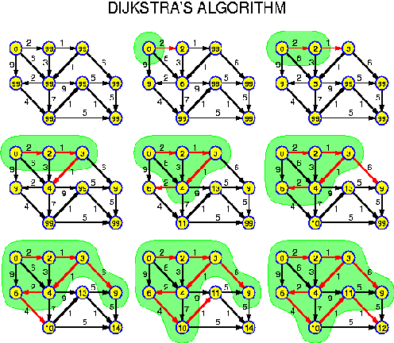

# Dijkstra
* 추천 문제
    * [[BOJ] 최소비용 구하기](https://www.acmicpc.net/problem/1916) [(소스코드)](./src/cost.cpp) - 다익스트라
    * [[BOJ] 최소비용 구하기 2](https://www.acmicpc.net/problem/11779) [(소스코드)](./src/cost2.cpp) - 다익스트라 + 경로
    * [[BOJ] 미로만들기](https://www.acmicpc.net/problem/2665) [(소스코드)](./src/maze.cpp) - WIP
    * [[BOJ] 특정한 최단 경로](https://www.acmicpc.net/problem/1504) [(소스코드)](./src/shortest_path.cpp) - WIP
    * [[BOJ] 민준이와 마산 그리고 건우](https://www.acmicpc.net/problem/18223) [(소스코드)](./src/friends.cpp) - WIP
    * [[BOJ] Obstacle Course](https://www.acmicpc.net/problem/4485) [(소스코드)](./src/course.cpp) - WIP
    * [[BOJ] Silver Cow Party](https://www.acmicpc.net/problem/1238) [(소스코드 - 최적화 전)](./src/party1.cpp) [(소스코드 - 최적화 후)](./src/party2.cpp) - 두 번의 다익스트라 알고리즘을 수행해 최단거리를 계산하는 문제
        * 최적화 수행 단계:
            1. 주어진 문제에서 단방향 간선들을 주어질 때, 출발지(<i>x</i>)에서 각 마을로 가는 최단거리를 한 번 다익스트라를 사용해 계산한다. 
            2. 주어진 간선들을 역으로 바꾸어 생각하면, 각 마을에서 출발지(<i>x</i>)로 가는 최단거리를 계산하는 문제가 된다. 
                * 만약, 마을 1에서 <i>x</i>로 가는 간선이 있고, 이때의 가중치가 3이다. 그리고 <i>x</i>에서 마을 1로 가는 간선이 있고, 이때의 가중치가 1이다. 
                * 주어진 간선에서 <i>x</i>로부터 각 마을로의 최단거리를 계산할 때 사용하는 간선은 가중치가 1인 간선이다.
                * 주어진 간선을 역으로 바꾼 뒤, <i>x</i>로부터 각 마을로의 최단거리를 계산할 때 사용하는 간선은 가중치가 3인 간선이다. 
                * 결국, 주어진 간선에서 출발지가 <i>x</i>일 때의 다익스트라를 계산한 결과(<i>x</i>에서 각 마을로 가는 경우)와 주어진 간선을 역으로 바꾼 뒤 출발지가 <i>x</i>일 때의 다익스트라를 계산한 결과(각 마을에서 <i>x</i>로 가는 경우)를 구해서 문제를 해결하면 주어진 문제와 논리적으로 동치이다. 
---

## 다익스트라 알고리즘
* 임의의 한 정점으로부터 모든 정점까지의 거리를 계산하는 알고리즘
* 임의의 한 점으로부터 근처 정점 간 거리를 계산한 뒤, 아직 방문 전인 정점들 중에서 거리가 가장 가까운 정점을 차례대로 방문해 최소거리를 계산하게 됨
    * 방문을 마친 정점은 다시 방문하지 않음



* 시간복잡도는 <b>O(<i>V</i><sup>2</sup>+<i>E</i>)</b>
* 만약, 간선의 개수 <i>E</i>가 그렇게 크지 않다면, `heap`을 사용해 시간복잡도를 <b>O(<i>E</i> log <i>E</i>)</b>로 줄여 사용할 수 있음
    * 간선의 크기가 거의 <i>V</i><sup>2</sup>에 근접하다면, `heap`이 아닌 일반적인 구현 방법을 사용하는 것이 더 효율적일 수 있음

### 연습문제
* [[BOJ] 최단경로](https://www.acmicpc.net/problem/1753) [(소스코드)](./src/exam1.cpp)
###### Memory: 9,112 KB, Time: 152 ms
```c++
#include <bits/stdc++.h>

using namespace std;

int main(void) 
{
    ios::sync_with_stdio(false);
    cin.tie(NULL);

    int v, e;
    cin>>v>>e;
    int start;
    cin>>start;
    //u, {cost, v};
    vector<vector<pair<int, int>>> adj_list(v+1);
    while (e--) {
        int u, v, w;
        cin>>u>>v>>w;
        adj_list[u].push_back({w,v});
    }

    // cost, v
    vector<int> d(v+1, 1e9);
    d[start]=0;
    priority_queue<pair<int, int>, 
        vector<pair<int, int>>, 
        greater<pair<int, int>>> pq;
    pq.push({d[start],start});
    while (!pq.empty()) {
        auto cur = pq.top();
        pq.pop();
        int dist = cur.first;
        int vtx = cur.second;

        // 예전 정보는 무시
        if (d[vtx]!=dist) {
            continue;
        }
        for (auto nxt : adj_list[vtx]) {
            int cost = nxt.first;
            int nxt_vtx = nxt.second;
            if (d[nxt_vtx]>dist+cost) {
                d[nxt_vtx]=dist+cost;
                pq.push({d[nxt_vtx],nxt_vtx});
            }
        }
    }

    for (int i = 1; i<=v; ++i) {
        if (d[i]==1e9) {
            cout << "INF";
        }
        else {
            cout << d[i];
        }
        cout << '\n';
    }

    return 0;
}
```

* [[BOJ] 최소비용 구하기](https://www.acmicpc.net/problem/1916) [(소스코드)](./src/cost.cpp) - 특정 정점으로부터 거리 계산
###### Memory: 4,748 KB, Time: 40 ms
```c++
// https://www.acmicpc.net/problem/1916
#include <bits/stdc++.h>

using namespace std;

int main(void) 
{
    ios::sync_with_stdio(false);
    cin.tie(NULL);

    int v, e;
    cin>>v>>e;
    //u, {cost, v};
    vector<vector<pair<int, int>>> adj_list(v+1);
    while (e--) {
        int u, v, w;
        cin>>u>>v>>w;
        adj_list[u].push_back({w,v});
    }
    int st, en;
    cin>>st>>en;

    // cost, v
    vector<int> d(v+1, 1e9);
    d[st]=0;
    priority_queue<pair<int, int>, 
        vector<pair<int, int>>, 
        greater<pair<int, int>>> pq;
    pq.push({d[st],st});
    while (!pq.empty()) {
        auto cur = pq.top();
        pq.pop();
        int dist = cur.first;
        int vtx = cur.second;

        if (d[vtx]!=dist) {
            continue;
        }
        for (auto nxt : adj_list[vtx]) {
            int cost = nxt.first;
            int nxt_vtx = nxt.second;
            if (d[nxt_vtx]>dist+cost) {
                d[nxt_vtx]=dist+cost;
                pq.push({d[nxt_vtx],nxt_vtx});
            }
        }
    }
    cout << d[en] << '\n';

    return 0;
}
```

* [[BOJ] 최소비용 구하기 2](https://www.acmicpc.net/problem/11779) [(소스코드)](./src/cost2.cpp) - 다익스트라 계산과 동시에 최단경로를 출력하는 문제
###### Memory: 4,752 KB, Time: 36 ms
```c++
#include <bits/stdc++.h>

using namespace std;

int main(void) 
{
    ios::sync_with_stdio(false);
    cin.tie(NULL);

    int v, e;
    cin>>v>>e;
    //u, {cost, v};
    vector<vector<pair<int, int>>> adj_list(v+1);
    while (e--) {
        int u, v, w;
        cin>>u>>v>>w;
        adj_list[u].push_back({w,v});
    }
    int st, en;
    cin>>st>>en;

    // cost, v
    vector<int> d(v+1, 1e9);
    d[st]=0;
    vector<int> p(v+1);
    priority_queue<pair<int, int>, 
        vector<pair<int, int>>, 
        greater<pair<int, int>>> pq;
    pq.push({d[st],st});
    while (!pq.empty()) {
        auto cur = pq.top();
        pq.pop();
        int dist = cur.first;
        int vtx = cur.second;

        // 예전 정보는 무시
        if (d[vtx]!=dist) {
            continue;
        }
        for (auto nxt : adj_list[vtx]) {
            int cost = nxt.first;
            int nxt_vtx = nxt.second;
            if (d[nxt_vtx]>dist+cost) {
                d[nxt_vtx]=dist+cost;
                pq.push({d[nxt_vtx],nxt_vtx});
                p[nxt_vtx]=vtx;
            }
        }
    }

    cout << d[en] << '\n';
    stack<int> s;
    int r = en;
    s.push(r);
    while (st!=p[r]) {
        r=p[r];
        s.push(r);
    }
    s.push(st);
    cout << s.size() << '\n';
    while (!s.empty()) {
        cout << s.top() << ' ';
        s.pop();
    }

    return 0;
}
```

## 벨만 포드(Bellman-Ford) 알고리즘 - WIP
* 정점 간 거리가 음수가 포함되었을 때 처리하는 방법

## A*(A star) 알고리즘 - WIP

---
|[이전 - Floyd-Warshall](/floyd-warshall/)|[목록](https://github.com/RyanJeong/CP#index)|[다음 - Disjoint-set](/disjoint-set/)|
|-|-|-|
