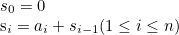

# Dynamic Programming
* 추천 문제 - 다이나믹 프로그래밍(기본)
    * [[BOJ] Four Squares](https://www.acmicpc.net/problem/17626) [(소스코드)](./src/four_square.cpp) - WIP
    * [[BOJ] Jump The Board!](https://www.acmicpc.net/problem/1890) [(소스코드)](./src/jump.cpp)
        * 초기에 백트래킹을 사용해 접근했으나, [TLE](./src/jump_tle.cpp)가 발생
        * 이처럼 탐색 경우의 수가 방대할 경우, DP를 사용해 해결해야 함
    * [[BOJ] 행렬 곱셈 순서](https://www.acmicpc.net/problem/11049) [(소스코드)](./src/210709_matrix.cpp)
---

* 추천 문제 - 누적합
    * [[BOJ] 수열](https://www.acmicpc.net/problem/2559) [(소스코드)](./src/series.cpp) - 누적합 기본 문제
    * [[BOJ] 두 배열의 합](https://www.acmicpc.net/problem/2143) [(소스코드)](./src/prefix_sum_matrix.cpp) - 부분합을 구한 뒤에 `lower_bound()`, `upper_boud()`를 이용해 조건을 만족하는 경우를 찾는 문제
    * [[BOJ] 색종이 - 3](https://www.acmicpc.net/problem/2571) [(소스코드)](./src/prefix_sum_colored_paper.cpp) - 2차원 배열에서의 구간 합을 계산한 뒤에, 조건을 만족하는 경우만 판별
    * [[BOJ] 수열의 구간 평균](https://www.acmicpc.net/problem/19566) [(소스코드)](./src/prefix_sum_seq_avg.cpp)
    * [[BOJ] Merging Files](https://www.acmicpc.net/problem/11066) [(소스코드)](./src/merging_files.cpp) - 누적합 + DP 문제
---

* 추천 문제 - 비트마스크를 이용한 동적 계획법
    * [[BOJ] 행렬 곱셈 순서](https://www.acmicpc.net/problem/11049) [(소스코드)](./src/210709_matrix.cpp)
    * [[BOJ] 외판원 순회](https://www.acmicpc.net/problem/2098) [(소스코드)](./src/tsp.cpp) - 비트마스킹 + DP
---

* 추천 문제 - 부분집합의 합
    * [[BOJ] Binomial](https://www.acmicpc.net/problem/18719) [(소스코드)](./src/sos_dp_binomial.cpp)
    * [[BOJ] KOŠARE](https://www.acmicpc.net/problem/2803) [(소스코드)](./src/sos_dp_toys.cpp)
---

* 추천 문제 - 냅색
    * [[BOJ] 카우버거 알바생](https://www.acmicpc.net/problem/17208) [(소스코드)](./src/knapsack_cow.cpp)
    * [[BOJ] 행운쿠키 제작소](https://www.acmicpc.net/problem/10982) [(소스코드)](./src/knapsack_cookie.cpp)
---

## 다이나믹 프로그래밍(동적 계획법, DP)
* 주어진 문제를 작은 단위로 나누어 각 단위에서의 결과를 계산하고, 이 계산한 결과를 원래 문제를 해결하는 데 사용
* 작은 단위에서 계산한 결과를 저장해둔 뒤 원래 문제를 해결할 때 재사용
    * 작은 단위에서 계산한 결과를 저장함으로써, 계산 속도를 향상시킬 수 있음

## 전략
1. 본래 문제를 작은 단위로 쪼개어 계산한 결과를 기록할 테이블 설정
    * 해당 테이블에서의 각 요소에 어떤 값을 기록할 것인지 정해야 함
2. 초기치 설정
3. 초기치를 이용한 점화식 설계

### 연습문제
* [[BOJ] 1로 만들기](https://www.acmicpc.net/problem/1463) [(소스코드)](./src/1.cpp)
###### Memory: 5,928 KB, Time: 4 ms
```c++
// https://www.acmicpc.net/problem/1463
#include <bits/stdc++.h>

using namespace std;

// 1. DP 테이블
// d[i]: i를 1로 만들기 위해 필요한 연산의 최소 회수
int d[1'000'001]; // 0, 1 ~ 1,000,000

int main(void)
{
    ios::sync_with_stdio(false);
    cin.tie(NULL);

    int n;
    cin>>n;
    // 2. 초기치 정의
    // d[0]=0 (not allow)
    //  -> 전역변수에 의해 자동 설정
    // d[1]=0 (연산 불필요)
    d[1]=0;

    for (int i = 2; i<=n; ++i) {
        // 3. 점화식 설계
        // d[i]를 1로 만들기 위한 방법:
        //   1)  3으로 나누기
        //   2)  2로 나누기
        //   3)  1 빼기
        // ex)  1->X(0)
        //      2->2/1 or 1-1(1)
        //      3->3/1(1)
        //      4->4/2 and 2/1 or 1-1(2)
        //      5->5-1 and 4/2 and 2/1 or 1-1(3)
        //      ...
        
        // 1을 뺀다.
        d[i]=d[i-1]+1;
        // 2로 나누어 떨어지면, 2로 나눈다.
        if (!(i%2)) {
            d[i]=min(d[i],d[i/2]+1);
        }
        // 3으로 나누어 떨어지면, 3으로 나눈다.
        if (!(i%3)) {
            d[i]=min(d[i],d[i/3]+1);
        }
    }
    cout << d[n];

    return 0;
}
```

* [[BOJ] Adding 1s, 2s, and 3s](https://www.acmicpc.net/problem/9095) [(소스코드)](./src/adding_1_2_3.cpp)
###### Memory: 2,020 KB, Time: 0 ms
```c++
// https://www.acmicpc.net/problem/9095
#include <bits/stdc++.h>

using namespace std;

// 1. 테이블 정의
// d[i]: 1, 2, 3을 사용해 표현할 수 있는 총 가지수
// ex. 4
// 1+1+1+1,
// 1+1+2,
// 1+2+1,
// 2+1+1,
// 2+2,
// 1+3, and
// 3+1.
int d[11]; // 0, 1 ~ 10;

int main(void)
{
    ios::sync_with_stdio(false);
    cin.tie(NULL);

    int t;
    cin >> t;
    // 2. 초기치 설정
    // d[0]: not allow
    // d[4]: 1+1+1 +1, 2+1 +1, 1+2 +1, 3 +1
    //        -> 3을 1, 2, 3으로 표현할 수 있는 방법, 4
    //       1+1 +2, 2 +2, 
    //        -> 2를 1, 2, 3으로 표현할 수 있는 방법, 2
    //       1 +3, 
    //        -> 1을 1, 2, 3으로 표현할 수 있는 방법, 1
    //        => d[4]=d[3]+d[2]+d[1];
    //        => 초기치 d[3], d[2], d[1]이 필요
    d[1]=1;
    d[2]=2;
    d[3]=4; 
    for (int i = 4; i<11; ++i) {
        d[i]=d[i-1]+d[i-2]+d[i-3];
    }
    while (t--) {
        int n;
        cin>>n;
        cout << d[n] << '\n';
    }

    return 0;
}
```

* [[BOJ] 계단 오르기](https://www.acmicpc.net/problem/2579) [(소스코드)](./src/stair.cpp)
###### Memory: 2,020 KB, Time: 0 ms
```c++
// https://www.acmicpc.net/problem/2579
#include <bits/stdc++.h>

using namespace std;

// 1. 테이블 정의
// d[i][j]: i 번째 계단을 밟았으며, 
//          이때 이전에 j 개의 계단을 밟았을 때의 총 점수
int d[302][2]; 
int s[302];

int main(void)
{
    ios::sync_with_stdio(false);
    cin.tie(NULL);

    int n;
    cin>>n;
    for (int i = 1; i<=n; ++i) {
        cin>>s[i];
    }

    if (n==1) {
        cout << s[1];
    } 
    else {
        // 2. 초기치 설정
        // d[1][0]: 이전에 밝은 계단이 없으므로, S[1]
        // d[1][1]: 이전에 밟은 계단이 1개이지만,
        //          i 번째 계단이 시작점이기에 0으로 기록
        // d[2][0]: 이전에 밟은 계단이 없으므로, S[2]
        // d[2][1]: 이전에 밟은 계단이 1개이므로 S[1]+S[2]
        d[1][0]=s[1];
        d[1][1]=0;
        d[2][0]=s[2];
        d[2][1]=s[1]+s[2];
        for (int i = 3; i<=n; ++i) {
            // 3. 점화식 설계
            // 3-1. 이전 계단을 밟지 않을 경우
            // 3-2. 이전 계단을 밟을 경우
            d[i][0]=max(d[i-2][0],d[i-2][1])+s[i];
            d[i][1]=d[i-1][0]+s[i];
        }
        cout << max(d[n][0],d[n][1]);
    }

    return 0;
}
```

* [[BOJ] RGB거리](https://www.acmicpc.net/problem/1149) [(소스코드)](./src/rgb1.cpp)
###### Memory: 2,020 KB, Time: 0 ms
```c++
// https://www.acmicpc.net/problem/1149
#include <bits/stdc++.h>

using namespace std;

// 1. 테이블 정의
// d[i][j]
// i번째 집을 j 색으로 칠할 때의 최소 비용
int d[1'001][3];
int r[1'001], g[1'001], b[1'001];

int main(void)
{
    ios::sync_with_stdio(false);
    cin.tie(NULL);

    int n;
    cin>>n;

    for (int i = 1; i<=n; ++i) {
        cin>>r[i]>>g[i]>>b[i];
    }
    // 2. 초기치 설정
    d[1][0]=r[1];
    d[1][1]=g[1];
    d[1][2]=b[1];
    for (int i = 2; i<=n; ++i) {
        // 3. 점화식 설계
        d[i][0]=min(d[i-1][1],d[i-1][2])+r[i];
        d[i][1]=min(d[i-1][0],d[i-1][2])+g[i];
        d[i][2]=min(d[i-1][0],d[i-1][1])+b[i];
    }
    cout << min({d[n][0],d[n][1],d[n][2]});

    return 0;
}
```

* [[BOJ] 2×n 타일링](https://www.acmicpc.net/problem/11726) [(소스코드)](./src/2_by_n.cpp)
###### Memory: 2,020 KB, Time: 0 ms

```c++
// https://www.acmicpc.net/problem/11726
#include <bits/stdc++.h>

using namespace std;

// 1. 테이블 설정
// d[i]: 2xi 크기의 직사각형을 채우는 방법 수
int d[1'001]; // 0, 1 ~ 1,000

int main(void)
{
    ios::sync_with_stdio(false);
    cin.tie(NULL);

    int n;
    cin>>n;
    // 2. 초기치 설정
    // 타일 종류: 1x2, 2x1
    // 2x1: 1 (|)
    // 2x2: 2 (|| or =)
    d[1]=1;
    d[2]=2;
    for (int i = 3; i<=n; ++i) {
        // 3. 점화식 설계
        // 2x3  (d[n-1]) + |
        //      (d[n-2]) + =
        // 2x4: (d[n-1]) + |
        //      (d[n-2]) + =
        d[i]=(d[i-1]+d[i-2])%10'007;
    }
    cout << d[n];

    return 0;
}
```
* [[BOJ] 1로 만들기 2](https://www.acmicpc.net/problem/12852) [(소스코드)](./src/1_2.cpp)
###### Memory: 9,832 KB, Time: 8 ms
```c++
// https://www.acmicpc.net/problem/12852
#include <bits/stdc++.h>

using namespace std;

// 1. 테이블 설계
// d[i]: i를 1로 만들기 위해 필요한 연산의 최소 회수
int d[1'000'001]; // 0, 1 ~ 1,000,000
// p[i]: i를 1로 만들기 위해 거치는 경로
int p[1'000'001]; // path

int main(void)
{
    ios::sync_with_stdio(false);
    cin.tie(NULL);

    int n;
    cin>>n;
    // 2. 초기치 정의
    // d[0]=0 (not allow)
    // p[0]=0 (not allow)
    //  -> 전역변수에 의해 자동 설정
    // d[1]=0 (연산 불필요)
    // p[1]=0 (i의 값이 1이므로, 경로가 없음)
    d[1]=0;
    p[1]=0;
    for (int i = 2; i <= n; ++i) {
        // 3. 점화식 설계
        // d[i]를 1로 만들기 위한 방법:
        //   1)  3으로 나누기
        //   2)  2로 나누기
        //   3)  1 빼기

        // 1을 뺀다.
        d[i]=d[i-1]+1;
        p[i]=i-1;
        // 2로 나누어 떨어지면, 2로 나눈다.
        if (!(i%2)) {
            // 최소 연산일 경우, d와 p 갱신
            if (d[i]>d[i/2]+1) {
                d[i]=d[i/2]+1;
                p[i]=i/2;
            }
        }
        // 3으로 나누어 떨어지면, 3으로 나눈다.
        if (!(i%3)) {
            // 최소 연산일 경우, d와 p 갱신
            if (d[i]>d[i/3]+1) {
                d[i]=d[i/3]+1;
                p[i]=i/3;
            }
        }
    }
    cout << d[n] << '\n';
    while (n) {
        cout << n << ' ';
        n=p[n];
    }

    return 0;
}

```

## 누적합(Prefix Sum)
* 배열 안 요소의 값이 변하지 않는다면, 임의의 연속된 구간 내 요소들의 합을 기록해 필요할 때 이를 활용하는 기법
* 크기가 <i>n</i>인 1차원 배열에서의 누적합 <i>s<sub>i</sub></i> :

    

* 크기가 <i>n</i>인 1차원 배열에서의 임의의 연속된 구간 내 요소들의 합:

    

* 크기가 <i>n</i>×<i>m</i>인 2차원 배열에서의 누적합 <i>s<sub>i,j</sub></i> :

    

* 크기가 <i>n</i>×<i>m</i>인 2차원 배열에서의 임의의 연속된 구간 내 요소들의 합:

    

### 연습문제
* [[BOJ] 구간 합 구하기 4](https://www.acmicpc.net/problem/11659) [(소스코드)](./src/prefix_sum_1d.cpp) - 1차원 배열에서의 구간 합
###### Memory: 2,800 KB, Time: 40 ms
```c++
// https://www.acmicpc.net/problem/11659
#include <bits/stdc++.h>

using namespace std;

int main(void)
{
    ios::sync_with_stdio(false);
    cin.tie(NULL);

    static int s[100'001]; // s[i] = s[i-1] + a[i]
    int n, m;
    cin>>n>>m;
    for (int i = 1; i<=n; ++i) {
        int a;
        cin>>a;
        s[i]=s[i-1]+a;
    }
    while (m--) {
        int i, j;
        cin>>i>>j;
        cout << s[j]-s[i-1] << '\n';
    }

    return 0;
}
```

* [[BOJ] 구간 합 구하기 5](https://www.acmicpc.net/problem/11660) [(소스코드)](./src/prefix_sum_2d.cpp) - 2차원 배열에서의 구간 합
###### Memory: 6,124 KB, Time: 124 ms
```c++
// https://www.acmicpc.net/problem/11660
#include <bits/stdc++.h>

using namespace std;

int main(void)
{
    ios::sync_with_stdio(false);
    cin.tie(NULL);

    static int s[1025][1025]; // s[i][j]=a[i][j]+s[i-1][j]+s[i][j-1]-s[i-1][j-1]
    int n, m;
    cin>>n>>m;
    for (int i = 1; i<=n; ++i) {
        for (int j = 1; j<=n; ++j) {
            int a;
            cin>>a;
            s[i][j]=a+s[i-1][j]+s[i][j-1]-s[i-1][j-1];
        }
    }
    while (m--) {
        int x1, y1, x2, y2;
        cin>>x1>>y1>>x2>>y2;
        cout << s[x2][y2]-s[x1-1][y2]-s[x2][y1-1]+s[x1-1][y1-1] << '\n';
    }

    return 0;
}
```

## 비트마스크를 이용한 동적 계획법(Bit DP)
### 비트마스킹
* 어떤 상태의 선택여부를 확인하고자 할 때 사용:
    * 어떤 옵션의 선택 여부
    * 어떤 정점의 방문 여부
    * ...

* 선택할 수 있는 경우의 수가 30개 이하처럼 적은 경우가 주어졌을 때, 비트마스킹을 활용할 수 있음

### 연습문제
* [[BOJ] 계단 수](https://www.acmicpc.net/problem/1562) [(소스코드)](./src/step.cpp)
###### Memory: 6,248 KB, Time: 8 ms
```c++
// https://www.acmicpc.net/problem/1562
#include <bits/stdc++.h>

using namespace std;

int req(int, int, int);
const int mod(1e9);

int g_n;
vector<vector<vector<int>>> g_v;

int main(void)
{
    ios::sync_with_stdio(false);
    cin.tie(NULL);

    cin>>g_n;;
    //v[g_n+1][10][1<<10];
    g_v=vector<vector<vector<int>>>(g_n+1,vector<vector<int>>(10,vector<int>(1<<10)));

    int res = 0;
    // 0으로 시작하는 수는 계단수가 아니다.
    for (int d = 1; d<10; ++d) {
        res=(res+req(1,d,1<<d))%mod;
    }
    cout << res; 

    return 0;
}

int req(int i, int d, int b)
{
    if (g_v[i][d][b]) {

        return g_v[i][d][b];
    }
    if (i==g_n) {

        return ((b==(1<<10)-1) ? 1 : 0);
    }
    if (d==0) { // 0->1
        g_v[i][d][b]=req(i+1,1,b|1<<1)%mod;
    }
    else if (d==9) { // 9->8
        g_v[i][d][b]=req(i+1,8,b|1<<8)%mod;
    }
    else { // n-1<-n->n+1
        g_v[i][d][b]=(req(i+1,d-1,b|1<<(d-1))+req(i+1,d+1,b|1<<(d+1)))%mod; 
    }

    return g_v[i][d][b];
}
```

## [WIP] 부분집합의 합(Sum over Subsets, SOS DP)

## [WIP] 냅색(Knapsack)

### 연습문제
* [[BOJ] 평범한 배낭](https://www.acmicpc.net/problem/12865) [(소스코드)](./src/knapsack.cpp)
###### Memory:  KB, Time:  ms
```c++
```

* [[BOJ] 평범한 배낭2](https://www.acmicpc.net/problem/12920) [(소스코드)](./src/knapsack2.cpp)
###### Memory:  KB, Time:  ms
```c++
```

---
|[이전 - Recursion](/recursion/)|[목록](https://github.com/RyanJeong/CP#index)|[다음 - LIS & LCS](/lis_lcs/)|
|-|-|-|