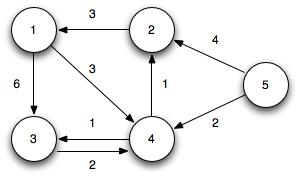
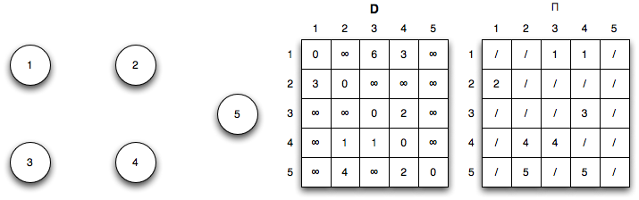
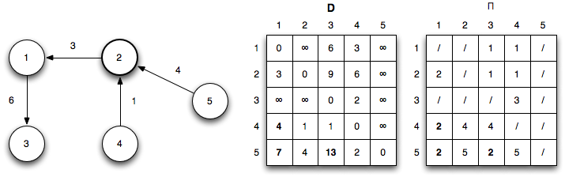
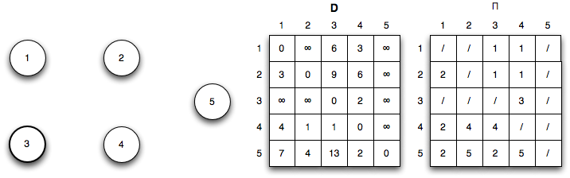
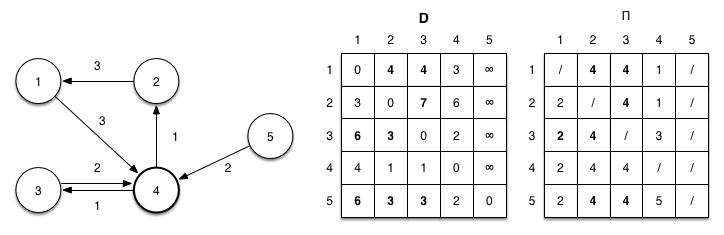
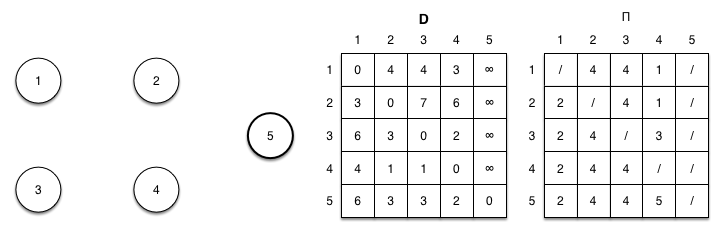
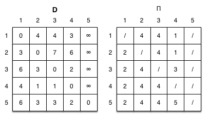

# Floyd-Warshall
* 추천 문제
    * [[BOJ] 경로 찾기](https://www.acmicpc.net/problem/11403) [(소스코드)](./src/path.cpp) - WIP
    * [[BOJ] Line Friends (Small)](https://www.acmicpc.net/problem/14588) [(소스코드)](./src/line_friend.cpp) - WIP
---

## 플로이드-워셜 알고리즘
* 가중 그래프에서 모든 정점간의 거리를 계산할 때 사용하는 알고리즘
* <i>V</i> 개의 정점이 존재할 경우, 1번 정점, 2번 정점, ..., <i>V</i>번 정점을 두 정점 사이에 경유하도록 설정하면서 두 정점 사이의 거리와 특정 정점을 경유했을 때의 거리를 비교해 최단거리를 계산
    * 두 정점 <i>u</i>, <i>v</i> 사이에 임의의 정점 <i>k</i>를 경유했을 때, <i>u</i>에서 <i>v</i>로 향하는 거리보다 <i>u</i>에서 <i>k</i>를 경유해 <i>v</i>로 향하는 거리가 더 짧을 경우, 앞으로 <i>u</i>에서 <i>v</i>를 향할 때 항상 <i>k</i> 정점을 경유하게 됨
* 위 과정을 <i>V</i>번 반복할 경우 모든 정점간의 거리를 계산할 수 있음
* 시간복잡도는 <b>O(<i>V</i><sup>3</sup>)</b>
    * <i>V</i> 번 경유 정점을 넣고 <i>V</i><sup>2</sup>번 비교연산


### 경로 복원(Path Reconstruction)
* 경로를 기록할 벡터를 별도로 할당해 최단거리를 구할 때마다 해당 벡터의 값을 수정
    * `p[i][j]`에 들어있는 값이 <i>k</i>일 때, <i>k</i>는 <i>i</i>에서 <i>j</i>로 향하는 경로 중 <i>j</i>에 방문하기 직전 정점을 기록함
    * <i>k</i>의 값이 <i>i</i>와 다르다면, 경로는 i->...->k->j가 됨
    * <i>k</i>의 값이 <i>i</i>와 같다면, 경로는 i->j가 됨
        * 예를 들어, `p[1][2]=3`일 경우, 정점 1에서 정점 2로 향하는 최단경로는 정점 3을 거쳐야 하며, 지금까지의 최단경로는 1->...->3->2가 됨
        * `p[1][3]=4`일 경우, 정점 1에서 정점 3으로 향하는 최단경로는 정점 4를 거쳐야 하며, 지금까지의 최단경로는 1->...->4->3이 됨
        * `p[1][4]=5`일 경우, 정점 1에서 정점 4로 향하는 최단경로는 정점 5를 거쳐야 하며, 지금까지의 최단경로는 1->...->5->4가 됨
        * `p[1][5]=1`일 경우, 정점 1에서 정점 5로 향하는 최단경로는 정점 1를 거쳐야 하며, 이때 시작 정점과 일치하므로 최단경로는 1->5가 됨
        * 위 정보들을 추합하면, 정점 1에서 정점 2까지의 최단경로는 1->5->4->3->2가 됨

* A directed graph

    

<br>

* Initialization: (<i>k</i> = 0)

    

<br>

* Iteration 1: (<i>k</i> = 1) Shorter paths from 2 ~ 3 and 2 ~ 4 are found through vertex 1

    

<br>

* Iteration 2: (<i>k</i> = 2) Shorter paths from 4 ~ 1, 5 ~ 1, and 5 ~ 3 are found through vertex 2

    

<br>

* Iteration 3: (<i>k</i> = 3) No shorter paths are found through vertex 3

    

<br>

* Iteration 4: (<i>k</i> = 4) Shorter paths from 1 ~ 2, 1 ~ 3, 2 ~ 3, 3 ~ 1, 3 ~ 2, 5 ~ 1, 5 ~ 2, 5 ~ 3, and 5 ~ 4 are found through vertex 4

    

<br>

* Iteration 5: (<i>k</i> = 5) No shorter paths are found through vertex 5

    

<br>

* The final shortest paths for all pairs is given by

    

### 연습문제
* [[BOJ] 플로이드](https://www.acmicpc.net/problem/11404) [(소스코드)](./src/floyd.cpp)
###### Memory: 2,156 KB, Time: 24 ms
```c++
// https://www.acmicpc.net/problem/11404
#include <bits/stdc++.h>

using namespace std;

int main(void) 
{
    ios::sync_with_stdio(false);
    cin.tie(NULL);

    int n, m;
    cin>>n>>m;
    vector<vector<int>> d(n+1,vector<int>(n+1));
    // 문제에서 올 수 있는 최대값보다 큰 값으로 초기 간선 가중치 초기화
    // 2e9는 오버플로우가 발생하기 때문에 최대값 설정에 주의해야 함
    fill(d.begin(),d.end(),vector<int>(n+1,1e9));
    for (int i = 1; i<=n; ++i) {
        d[i][i]=0;
    }
    while (m--) {
        int a, b, c;
        cin>>a>>b>>c;
        d[a][b]=min(d[a][b],c);
    }

    for (int k = 1; k<=n; ++k) {
        for (int i = 1; i<=n; ++i) {
            for (int j = 1; j<=n; ++j) {
                d[i][j]=min(d[i][j],d[i][k]+d[k][j]);
            }
        }
    }

    for (int i = 1; i<=n; ++i) {
        for (int j = 1; j<=n; ++j) {
            if (d[i][j]==1e9) {
                cout << 0;
            }
            else {
                cout << d[i][j];
            }
            cout << ' ';
        }
        cout << '\n';
    }

    return 0;
}
```

## Johnson's Algorithm - WIP

* [[BOJ] 플로이드2](https://www.acmicpc.net/problem/11780) [(소스코드)](./src/floyd2.cpp) - 플로이드 + 경로복원
###### Memory:  KB, Time:  ms
```c++
#include <bits/stdc++.h>

using namespace std;

int main(void) 
{
    ios::sync_with_stdio(false);
    cin.tie(NULL);

    int n, m;
    cin>>n>>m;
    vector<vector<int>> d(n+1,vector<int>(n+1));
    vector<vector<int>> p(n+1,vector<int>(n+1));
    fill(d.begin(),d.end(),vector<int>(n+1,1e9));
    for (int i = 1; i<=n; ++i) {
        d[i][i]=0;
    }
    while (m--) {
        int a, b, c;
        cin>>a>>b>>c;
        d[a][b]=min(d[a][b],c);
        p[a][b]=a;
    }

    for (int k = 1; k<=n; ++k) {
        for (int i = 1; i<=n; ++i) {
            for (int j = 1; j<=n; ++j) {
                if (d[i][j]>d[i][k]+d[k][j]) {
                    d[i][j]=d[i][k]+d[k][j];
                    p[i][j]=p[k][j];
                }
            }
        }
    }

    for (int i = 1; i<=n; ++i) {
        for (int j = 1; j<=n; ++j) {
            if (d[i][j]==1e9) {
                cout << 0;
            }
            else {
                cout << d[i][j];
            }
            cout << ' ';
        }
        cout << '\n';
    }

    for (int i = 1; i<=n; ++i) {
        for (int j = 1; j<=n; ++j) {
            if (!p[i][j]) {
                cout << 0;
            }
            else {
                stack<int> s;
                int r = j;
                s.push(r);
                while (p[i][r]!=i) {
                    r=p[i][r];
                    s.push(r);
                }
                s.push(i);
                cout << s.size() << ' ';
                while (!s.empty()) {
                    cout << s.top() << ' ';
                    s.pop();
                }
            }
            cout << '\n';
        }
    }

    return 0;
}
```

---
|[이전 - Minimum Spanning Tree](/mst/)|[목록](https://github.com/RyanJeong/CP#index)|[다음 - Dijkstra](/dijkstra/)|
|-|-|-|
