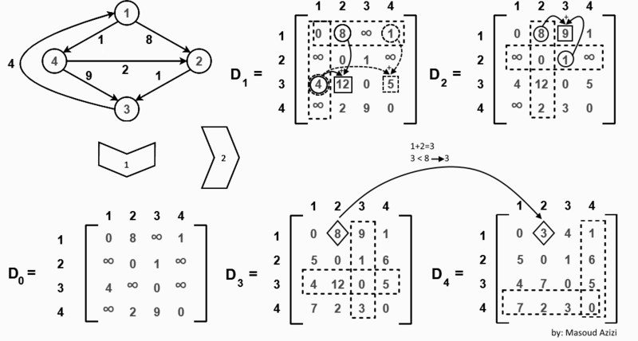

# Floyd-Warshall
* 추천 문제
    * [[BOJ] 경로 찾기](https://www.acmicpc.net/problem/11403) [(소스코드)](./src/path.cpp) - WIP
    * [[BOJ] Line Friends (Small)](https://www.acmicpc.net/problem/14588) [(소스코드)](./src/line_friend.cpp) - WIP
---

## 플로이드-워셜 알고리즘
* 가중 그래프에서 두 정점 간 최단거리를 계산하는 알고리즘
* 중간에 경유할 수 있는 정점을 넣었을 때의 거리와 넣지 않았을 때의 정점 거리를 계산해 해당 정점 사이의 최단거리를 계산함
    * 모든 정점을 한 번씩 넣어 최단거리를 계산하게 됨
* 시간복잡도는 <b>O(<i>V</i><sup>3</sup>)</b>



### 경로 복원(Path Reconstruction)
* 경로를 기록할 벡터를 별도로 할당해 최단거리를 구할 때마다 해당 벡터의 값을 수정


### 연습문제
* [[BOJ] 플로이드](https://www.acmicpc.net/problem/11404) [(소스코드)](./src/floyd.cpp)
###### Memory: 2,156 KB, Time: 24 ms
```c++
#include <bits/stdc++.h>

using namespace std;

int main(void) 
{
    ios::sync_with_stdio(false);
    cin.tie(NULL);

    int n, m;
    cin>>n>>m;
    vector<vector<int>> floyd(n+1,vector<int>(n+1));
    // 문제에서 올 수 있는 최대값보다 큰 값으로 초기 간선 가중치 초기화
    // 2e9는 오버플로우가 발생하기 때문에 최대값 설정에 주의해야 함
    fill(floyd.begin(),floyd.end(),vector<int>(n+1,1e9));
    for (int i = 1; i<=n; ++i) {
        floyd[i][i]=0;
    }
    while (m--) {
        int a, b, c;
        cin>>a>>b>>c;
        floyd[a][b]=min(floyd[a][b],c);
    }

    for (int k = 1; k<=n; ++k) {
        for (int i = 1; i<=n; ++i) {
            for (int j = 1; j<=n; ++j) {
                floyd[i][j]=min(floyd[i][j],floyd[i][k]+floyd[k][j]);
            }
        }
    }

    for (int i = 1; i<=n; ++i) {
        for (int j = 1; j<=n; ++j) {
            if (floyd[i][j]==1e9) {
                cout << 0;
            }
            else {
                cout << floyd[i][j];
            }
            cout << ' ';
        }
        cout << '\n';
    }

    return 0;
}
```

## Johnson's Algorithm - WIP

### 연습문제
* [[BOJ] 플로이드2](https://www.acmicpc.net/problem/11780) [(소스코드)](./src/floyd2.cpp)
###### Memory:  KB, Time:  ms
```c++
```


---
|[이전 - Minimum Spanning Tree](/mst/)|[목록](https://github.com/RyanJeong/CP#index)|[다음 - Dijkstra](/dijkstra/)|
|-|-|-|
