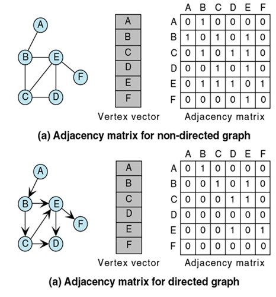
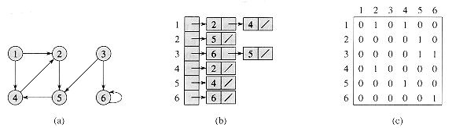
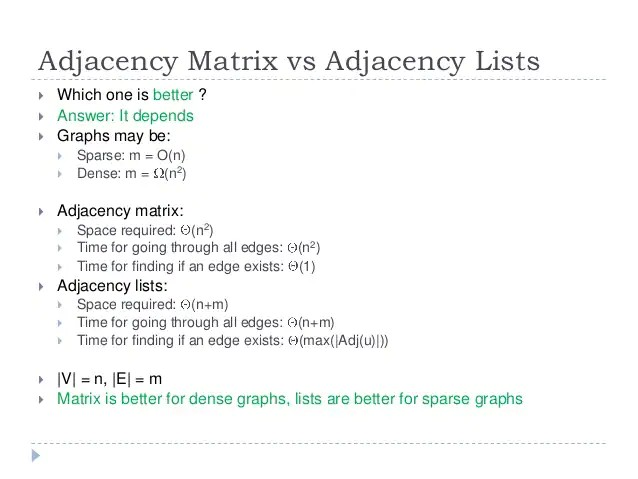

# Graph
* 추천 문제
    * [[BOJ] 촌수계산](https://www.acmicpc.net/problem/2644) [(소스코드)](./src/cousin.cpp) - 기본적인 그래프 BFS 순회 문제
    * [[BOJ] DFS와 BFS](https://www.acmicpc.net/problem/1260) [(소스코드 - DFS 재귀)](./src/dfs_bfs_1.cpp) [(소스코드 - DFS 비재귀)](./src/dfs_bfs_2.cpp)
    * [[BOJ] パーティー](https://www.acmicpc.net/problem/5567) [(소스코드)](./src/party.cpp) - BFS + 단계 별 순회
    * [[BOJ] Hide and Seek](https://www.acmicpc.net/problem/6118) [(소스코드)](./src/hide_and_seek.cpp) - 거리 계산에는 BFS 사용
    * [[BOJ] HIPERCIJEVI](https://www.acmicpc.net/problem/5214) [(소스코드)](./src/hyper.cpp) - 정점 간 간선이 너무 많을 경우, 잉여 정점을 더 생성해 메모리 초과 문제를 해결할 수 있음
---

## 그래프
* 기본 용어
    * 정점(Vertex, Node): 그래프를 구성하는 요소중의 하나로 연결점
    * 간선(Edge): 두 정점 간을 이어주는 선분
    * 차수(Degree): 정점에 연결된 간선 개수
    * 무방향 그래프(Undirected Graph): 간선에 방향성이 없는 경우
    * 방향 그래프(Directed Graph) 간선에 방향성이 있는 경우
        * Outdegree: 해당 정점으로부터 나가는 간선의 수
        * Indegree: 해당 정점으로부터 들어오는 간선의 수
    * 순환 그래프(Cyclic Graph): 임의의 한 정점으로부터 출발해 자기 자신으로 돌아올 수 있는 경로(cycle)가 존재하는 그래프
    * 비순환 그래프(Acyclic Graph): 임의의 한 정점으로부터 출발해 자기 자신으로 돌아올 수 있는 경로가 존재하지 않는 그래프
    * 완전 그래프(Complete Graph): 모든 서로 다른 두 정점 쌍이 간선으로 연결된 그래프
    * 연결 그래프(Connected Graph): 임의의 두 정점 사이에 경로가 존재하는 그래프
    * 단순 그래프(Simple Graph): 임의의 두 정점 사이에 오직 1개의 간선만이 연결되어 있는 그래프

* 표현
    * 인접 행렬(Adjacency Matrix)
        * 총 정점 수가 <i>V</i>일 때, 공간복잡도는 <b>O(<i>V</i><sup>2</sup>)</b>
        * 정점 연결 상태 확인 시 시간복잡도는 <b>O(1)</b>
        * 어떤 정점에 연결되어 있는 정점들을 확인하고자 할 때의 시간복잡도는 <b>O(<i>V</i>)</b>

        

        * 무방향 그래프를 인접 행렬로 표현 시 대칭 형태를 나타냄
        * 방향 그래프를 인접 행렬로 표현하면 행은 출발 정점, 열은 도착 정점을 나타냄
        * 행과 열이 가리키는 위치에 있는 값은 간선의 가중치
        * 행과 열이 0이라면, 해당 행에서 열로 향하는 간선은 존재하지 않음
        ```c++
            // n X m directed graph
            vector<vector<int>> adj_matrix(n+1,vector(m+1)); // 1-based

            int e;
            cin>>e;
            for (int i = 1; i<=e; ++i) {
                int u, v;
                cin>>u>>v;
                adj_matrix[u][v]=1;
            }

            // n X m undirected graph
            vector<vector<int>> adj_matrix(n+1,vector(m+1)); // 1-based

            int e;
            cin>>e;
            for (int i = 1; i<=e; ++i) {
                int u, v;
                cin>>u>>v;
                adj_matrix[u][v]=1;
                adj_matrix[v][u]=1;
            }
        ```

    * 인접 리스트(Adjacency Lists)
        * 총 정점 수가 <i>V</i>, 총 간선 수가 <i>E</i>일 때, 공간복잡도는 <b>O(<i>V</i>+<i>E</i>)</b>
            * <i>V</i>가 크면서 상대적으로 <i>E</i>가 작을 경우 공간을 절약할 수 있음
            * 모든 리스트에서의 원소 개수는 방향 그래프일 경우 <i>E</i>개, 무방향 그래프일 경우 2<i>E</i>개
        * 어떤 정점에 연결되어 있는 정점들을 확인하고자 할 때, 해당 정점에 연결된 리스트의 수만큼만 순회하면 결과를 얻을 수 있음 (<b>O(dev(<i>V</i>))</b>)

        
        

        ```c++
            // n X m directed graph
            vector<vector<int>> adj_list(n+1); // 1-based

            int e;
            cin>>e;
            for (int i = 1; i<=e; ++i) {
                int u, v;
                adj_list[u].push_back(v);
            }

            // n X m undirected graph
            vector<vector<int>> adj_list(n+1); // 1-based

            int e;
            cin>>e;
            for (int i = 1; i<=e; ++i) {
                int u, v;
                adj_list[u].push_back(v);
                adj_list[v].push_back(u);
            }
        ```
    
    * 비교

    

## 그래프를 사용한 BFS
* 모든 정점이 `queue`에 1번씩 들어가므로, 인접 행렬에서의 시간복잡도는 <b>O(<i>V</i><sup>2</sup>)</b>, 인접 리스트에서의 시간복잡도는 <b>O(<i>V</i>+<i>E</i>)</b>
* 연결 그래프에서의 순회
```c++
    vector<vector<int>> adj_list(n+1); // 1-based
    vector<bool> is_visited(n+1);

    void bfs()
    {
        queue<int> q;
        q.push(1);
        is_visited[1]=true;
        while (!q.empty()) {
            int cur = q.front();
            q.pop();
            cout << cur << ' ';

            for (int next : adj_list[cur]) {
                if (is_visited[next]) {
                    continue;
                }
                q.push(next);
                is_visited[next]=true;
            }
        }

        return;
    }
```

* 연결 그래프에서 1번 정점과의 거리
```c++
    vector<vector<int>> adj_list(n+1); // 1-based
    vector<int> dist(n+1);

    void bfs()
    {
        for (int i = 1; i<=n; ++i) {
            dist[i]=-1; // init.
        }

        queue<int> q;
        q.push(1);
        dist[1]=0;
        while (!q.empty()) {
            int cur = q.front();
            q.pop();

            for (int next : adj_list[cur]) {
                if (dist[next]!=-1) {
                    continue;
                }
                q.push(next);
                dist[next]=dist[cur]+1;
            }
        }

        return;
    }
```

* 연결 그래프가 아닐 때의 순회
```c++
    vector<vector<int>> adj_list(n+1); // 1-based
    vector<bool> is_visited(n+1);

    void bfs(int v)
    {
        queue<int> q;
        for (int i = 1; i<=v; ++i) {
            if (is_visited[i]) {
                continue;
            }

            q.push(i);
            is_visited[i]=true;
            while (!q.empty()) {
                int cur = q.front();
                q.pop();
                cout << cur << ' ';

                for (int next : adj_list[cur]) {
                    if (is_visited[next]) {
                        continue;
                    }
                    q.push(next);
                    is_visited[next]=true;
                }
            }
        }

        return;
    }
```

## 그래프를 사용한 DFS
* 모든 정점이 `queue`에 1번씩 들어가므로, 인접 행렬에서의 시간복잡도는 <b>O(<i>V</i><sup>2</sup>)</b>, 인접 리스트에서의 시간복잡도는 <b>O(<i>V</i>+<i>E</i>)</b>
* 연결 그래프에서의 순회(비재귀 방법)
    * 연결된 정점이 여러 개일 때, <b>BFS</b>와 유사하게 동작
    * <b>일반적인 DFS 동작과 차이가 있음</b>
```c++
    vector<vector<int>> adj_list(n+1); // 1-based
    vector<bool> is_visited(n+1);

    void dfs()
    {
        stack<int> s;
        s.push(1);
        is_visited[1]=true;
        while (!s.empty()) {
            int cur = s.top();
            s.pop();
            cout << cur << ' ';

            for (int next : adj_list[cur]) {
                if (is_visited[next]) {
                    continue;
                }
                s.push(next);
                is_visited[next]=true;
            }
        }

        return;
    }
```

* 연결 그래프에서의 순회(재귀 방법)
    * 일반적인 DFS 동작 코드 I
```c++
    vector<vector<int>> adj_list(n+1); // 1-based
    vector<bool> is_visited(n+1);

    is_visited[1]=true;
    dfs(1);
   
    ...

    void dfs(int cur)
    {
        cout << cur << ' ';

        for (int next : adj_list[cur]) {
            if (is_visited[next]) {
                continue;
            }
            is_visited[next]=true;
            dfs(next);
        }

        return;
    }
```

* 연결 그래프에서의 순회(비재귀 방법)
    * 일반적인 DFS 동작 코드 II
```c++
    vector<vector<int>> adj_list(n+1); // 1-based
    vector<bool> is_visited(n+1);

    void dfs()
    {
        stack<int> s;
        s.push(1);
        while (!s.empty()) {
            int cur = s.top();
            s.pop();
            if (is_visited[cur]) {
                continue;
            }
            is_visited[cur]=true;
            cout << cur << ' ';

            for (int next : adj_list[cur]) {
                if (is_visited[next]) {
                    continue;
                }
                s.push(next);
            }
        }

        return;
    }
```

* 연결 그래프가 아닐 때의 순회
```c++
    vector<vector<int>> adj_list(n+1); // 1-based
    vector<bool> is_visited(n+1);

    void dfs(int v)
    {
        stack<int> s;
        for (int i = 1; i<=v; ++i) {
            if (is_visited[i]) {
                continue;
            }

            s.push(i);
            while (!s.empty()) {
                int cur = s.top();
                s.pop();
                if (is_visited[cur]) {
                    continue;
                }
                is_visited[cur]=true;
                cout << cur << ' ';

                for (int next : adj_list[cur]) {
                    if (is_visited[next]) {
                        continue;
                    }
                    s.push(next);
                }
            }
        }

        return;
    }
```


### 연습문제
* [[BOJ] 연결 요소의 개수](https://www.acmicpc.net/problem/11724)<br>[(소스코드 - BFS)](./src/exam1_bfs.cpp)<br>[(소스코드 - DFS 비재귀 I)](./src/exam1_dfs1.cpp)<br>[(소스코드 - DFS 비재귀 II)](./src/exam1_dfs2.cpp)<br>[(소스코드 - DFS 재귀)](./src/exam1_dfs_rec.cpp) - 추천
```c++
// BFS
#include <bits/stdc++.h>

using namespace std;

int main(void)
{
    ios::sync_with_stdio(false);
    cin.tie(NULL);
    
    int n, m;
    cin>>n>>m;
    vector<vector<int>> adj_list(n+1);
    for (int i = 1; i<=m; ++i) {
        int u, v;
        cin>>u>>v;
        adj_list[u].push_back(v);
        adj_list[v].push_back(u);
    }

    vector<bool> is_visited(n+1);
    queue<int> q;
    int res = 0;
    for (int i = 1; i<=n; ++i) {
        if (is_visited[i]) {
            continue;
        }
        
        ++res;
        q.push(i);
        is_visited[i]=true;
        while (!q.empty()) {
            int cur = q.front();
            q.pop();

            for (int next : adj_list[cur]) {
                if (is_visited[next]) {
                    continue;
                }
                q.push(next);
                is_visited[next]=true;
            }
        }
    }
    cout << res;

    return 0;
}
```

```c++
// DFS 1 - BFS 유사 동작 
#include <bits/stdc++.h>

using namespace std;

int main(void)
{
    ios::sync_with_stdio(false);
    cin.tie(NULL);
    
    int n, m;
    cin>>n>>m;
    vector<vector<int>> adj_list(n+1);
    for (int i = 1; i<=m; ++i) {
        int u, v;
        cin>>u>>v;
        adj_list[u].push_back(v);
        adj_list[v].push_back(u);
    }

    vector<bool> is_visited(n+1);
    stack<int> s;
    int res = 0;
    for (int i = 1; i<=n; ++i) {
        if (is_visited[i]) {
            continue;
        }

        ++res;
        s.push(i);
        is_visited[i]=true;
        while (!s.empty()) {
            int cur = s.top();
            s.pop();

            for (int next : adj_list[cur]) {
                if (is_visited[next]) {
                    continue;
                }
                s.push(next);
                is_visited[next]=true;
            }
        }
    }
    cout << res;

    return 0;
}
```

```c++
// DFS 2 - 일반적인 DFS 동작
#include <bits/stdc++.h>

using namespace std;

int main(void)
{
    ios::sync_with_stdio(false);
    cin.tie(NULL);
    
    int n, m;
    cin>>n>>m;
    vector<vector<int>> adj_list(n+1);
    for (int i = 1; i<=m; ++i) {
        int u, v;
        cin>>u>>v;
        adj_list[u].push_back(v);
        adj_list[v].push_back(u);
    }

    vector<bool> is_visited(n+1);
    stack<int> s;
    int res = 0;
    for (int i = 1; i<=n; ++i) {
        if (is_visited[i]) {
            continue;
        }

        ++res;
        s.push(i);
        while (!s.empty()) {
            int cur = s.top();
            s.pop();
            if (is_visited[cur]) {
                continue;
            }
            is_visited[cur]=true;

            for (int next : adj_list[cur]) {
                if (is_visited[next]) {
                    continue;
                }
                s.push(next);
            }
        }
    }
    cout << res;

    return 0;
}
```

```c++
// DFS Rec.
#include <bits/stdc++.h>

using namespace std;

void dfs(int cur);

vector<bool> is_visited;
vector<vector<int>> adj_list;

int main(void)
{
    ios::sync_with_stdio(false);
    cin.tie(NULL);
    
    int n, m;
    cin>>n>>m;
    adj_list=vector<vector<int>>(n+1);
    for (int i = 1; i<=m; ++i) {
        int u, v;
        cin>>u>>v;
        adj_list[u].push_back(v);
        adj_list[v].push_back(u);
    }

    is_visited=vector<bool>(n+1);
    int res = 0;
    for (int i = 1; i<=n; ++i) {
        if (is_visited[i]) {
            continue;
        }
        
        ++res;
        is_visited[i]=true;
        dfs(i);
    }
    cout << res;

    return 0;
}

void dfs(int cur)
{
    for (int next : adj_list[cur]) {
        if (is_visited[next]) {
            continue;
        }
        is_visited[next]=true;
        dfs(next);
    }

    return;
}
```

---
|[이전 - Two Pointer](/two_pointer/)|[목록](https://github.com/RyanJeong/CP#index)|[다음 - Tree](/tree/)|
|-|-|-|
