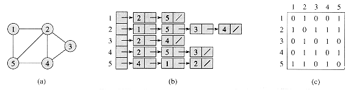

# Graph
* 추천 문제
    * [[BOJ] ](https://www.acmicpc.net/problem/) [(소스코드)](./src/.cpp)
---

## 그래프
* 기본 용어
    * 정점(Vertex, Node): 그래프를 구성하는 요소중의 하나로 연결점
    * 간선(Edge): 두 정점 간을 이어주는 선분
    * 차수(Degree): 정점에 연결된 간선 개수
    * 무방향 그래프(Undirected Graph): 간선에 방향성이 없는 경우
    * 방향 그래프(Directed Graph) 간선에 방향성이 있는 경우
        * Outdegree: 해당 정점으로부터 나가는 간선의 수
        * Indegree: 해당 정점으로부터 들어오는 간선의 수
    * 순환 그래프(Cyclic Graph): 임의의 한 정점으로부터 출발해 자기 자신으로 돌아올 수 있는 경로(cycle)가 존재하는 그래프
    * 비순환 그래프(Acyclic Graph): 임의의 한 정점으로부터 출발해 자기 자신으로 돌아올 수 있는 경로가 존재하지 않는 그래프
    * 완전 그래프(Complete Graph): 모든 서로 다른 두 정점 쌍이 간선으로 연결된 그래프
    * 연결 그래프(Connected Graph): 임의의 두 정점 사이에 경로가 존재하는 그래프
    * 단순 그래프(Simple Graph): 임의의 두 정점 사이에 오직 1개의 간선만이 연결되어 있는 그래프

* 표현
    * 인접 행렬(Adjacency Matrix)
        * 총 정점 수가 <i>V</i>일 때, 공간복잡도는 <b>O(<i>V</i><sup>2</sup>)</b>

        

        * 무방향 그래프에서는 인접 행렬이 대칭 형태를 나타냄
        * 방향 그래프에서는 인접 행렬의 행은 출발지, 열은 도착지를 나타냄

    * 인접 리스트(Adjacency Lists)
        * 총 정점 수가 <i>V</i>, 총 간선 수가 <i>E</i>일 때, 공간복잡도는 <b>O(<i>V</i>+<i>E</i>)</b>

        
        


### 연습문제
* [[BOJ] ](https://www.acmicpc.net/problem/) [(소스코드)](./src/.cpp)
###### Memory:  KB, Time:  ms
```c++
```

---
|[이전 - String](/string/)|[목록](https://github.com/RyanJeong/CP#index)|[다음 - Tree](/tree/)|
|-|-|-|
