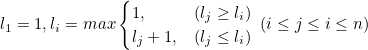
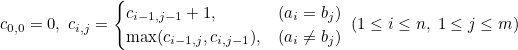
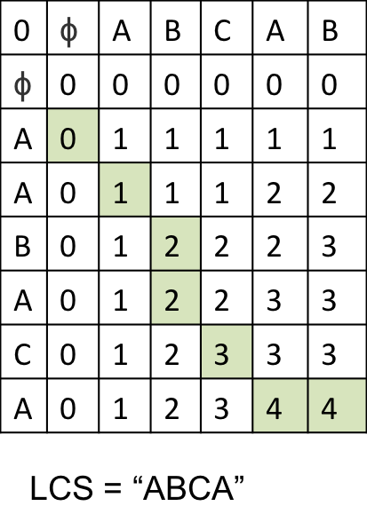

# LIS & LCS
* 추천 문제 - 최장 증가 부분수열
    * [[BOJ] 가장 큰 증가 부분 수열](https://www.acmicpc.net/problem/11055) [(소스코드)](./src/lis_app1.cpp) - LIS 응용, 조건을 만족하는 값들을 누적하는 문제
    * [[BOJ] 전깃줄](https://www.acmicpc.net/problem/2565) [(소스코드)](./src/wire1.cpp) - <b>O(<i>n</i><sup>2</sup>)</b>로 해결할 수 있는 문제
    * [[BOJ] 반도체 설계](https://www.acmicpc.net/problem/2352) [(소스코드)](./src/semiconductor.cpp) - 이분탐색을 이용해 시간복잡도를 <b>O(<i>n</i> log <i>n</i>)</b>로 낮추어 해결해야 하는 문제 1
    * [[BOJ] 주식](https://www.acmicpc.net/problem/12014) [(소스코드)](./src/stock.cpp) - 이분탐색을 이용해 시간복잡도를 <b>O(<i>n</i> log <i>n</i>)</b>로 낮추어 해결해야 하는 문제 2
    * [[BOJ] 전깃줄 - 2](https://www.acmicpc.net/problem/2568) [(소스코드)](./src/wire2.cpp) - 이분탐색과 부분 수열을 출력해야 하는 문제
    * [[BOJ] 이상한 전깃줄](https://www.acmicpc.net/problem/16474) [(소스코드)](./src/weird_wire.cpp) - 이분탐색과 부분 수열을 출력해야 하는 문제
    * [[BOJ] Nested Dolls](https://www.acmicpc.net/problem/5058) [(소스코드)](./src/dolls.cpp) - 문제 조건에 맞게 데이터 정렬 후 이분탐색
    * [[BOJ] Cow Jog](https://www.acmicpc.net/problem/10651) [(소스코드)](./src/cow_jog.cpp) - Longest non-increasing subsequence를 해결하는 문제
    * [[BOJ] 먹이사슬](https://www.acmicpc.net/problem/2532) [(소스코드)](./src/food_chain.cpp) - Longest non-increasing subsequence + `unique`를 사용한 중복 제거
---

* 추천 문제 - 최장 공통 부분수열
    * [[Codeforces] B. Catching Cheaters](https://codeforces.com/contest/1446/problem/B) [(소스코드)](./src/cheater.cpp) - LCS 개념을 기반으로 DP를 사용한 문제
    * [[BOJ] LCS 4](https://www.acmicpc.net/problem/13711) [(소스코드)](./src/lcs_4.cpp) - LCS의 시간복잡도는 <b>O(<i>nm</i>)</b>이며, 간접 정렬(indirect sorting)을 사용해 LCS를 LIS 문제처럼 다루어 시간복잡도를 <b>O(<i>n</i> log <i>n</i>)</b>로 낮추어 해결해야 함 
        * 두 수열의 LCS = 간접 정렬 후 두 수열의 LIS
---

## 최장 증가 부분수열(Longest Increasing Subsequence, LIS)
* 임의의 수열이 주어졌을 때, 수열의 요소 값이 오름차순으로 등장하는 가장 긴 구간을 의미
* 구간 내 모든 요소들이 오름차순 상태가 아닐 수 있음
    * 수열 <i>a</i> = {3,1,4,2,6,8,5}가 주여졌을 때, LIS는 {1,2,6,8}

* 임의의 수열 내 LIS가 두 개 이상 존재할 수 있음
    * 수열 <i>a</i> = {3,5,7,9,2,1,4,8}가 주어졌을 때, LIS는 {3,5,7,9}, {3,5,7,8}

* 크기가 <i>n</i>인 수열 <i>a</i>에서의 LIS <i>l<sub>i</sub></i> :

    

### 연습문제
* [[BOJ] 가장 긴 증가하는 부분 수열](https://www.acmicpc.net/problem/11053) [(소스코드)](./src/lis_1.cpp) - <b>O(<i>n</i><sup>2</sup>)</b>
```c++
// https://www.acmicpc.net/problem/11053
#include <bits/stdc++.h>

using namespace std;

int main(void)
{
    ios::sync_with_stdio(false);
    cin.tie(NULL);

    static int arr[1'001];
    static int lis[1'001];
    int n;
    cin>>n;
    for (int i = 1; i<=n; ++i) {
        cin>>arr[i];
    }

    // O(n^2)
    int res = 1;
    lis[1]=1;
    for (int i = 2; i<=n; ++i) {
        for (int j = 1; j<i; ++j) {
            if (arr[i]>arr[j]) {
                lis[i]=max(lis[i],lis[j]+1);
            }
            else {
                lis[i]=max(lis[i],1);
            }
        }
        res=max(res,lis[i]);
    }
    cout << res;

    return 0;
}
```

* [[BOJ] 가장 긴 바이토닉 부분 수열](https://www.acmicpc.net/problem/11054) [(소스코드)](./src/bitonic.cpp) - 가장 긴 증가하는 부분 수열 + 가장 긴 감소하는 부분 수열
```c++
// https://www.acmicpc.net/problem/11054
// {1 5 2 1 4 3 4 5 2 1}
// {1  2      3 4 5}     -> +5(LIS)
//               {5 2 1} -> +3(LDS)
//               {5}     -> -1(DUP)
#include <bits/stdc++.h>

using namespace std;

int main(void)
{
    ios::sync_with_stdio(false);
    cin.tie(NULL);

    static int arr[1'001];
    static int lis[1'001];
    static int lds[1'001];
    int n;
    cin>>n;
    lis[1]=1;
    for (int i = 1; i<=n; ++i) {
        cin>>arr[i];
        for (int j = 1; j<i; ++j) {
            if (arr[i]>arr[j]) {
                lis[i]=max(lis[i],lis[j]+1);
            }
            else {
                lis[i]=max(lis[i],1);
            }
        }
    }

    lds[n]=1;
    for (int i = n-1; i>0; --i) {
        for (int j = n; j>i; --j) {
            if (arr[i]>arr[j]) {
                lds[i]=max(lds[i],lds[j]+1);
            }
            else {
                lds[i]=max(lds[i],1);
            }
        }
    }
    int res = 1;
    for (int i = 1; i<=n; ++i) {
        res=max(res,lis[i]+lds[i]);
    }
    cout << res-1;

    return 0;
}
```

* [[BOJ] 가장 긴 증가하는 부분 수열 2](https://www.acmicpc.net/problem/12015) [(소스코드 1)](./src/lis_2.cpp) [(소스코드 2)](./src/lis_2_opt.cpp) - 이분탐색을 사용하면 시간복잡도를 <b>O(<i>n</i> log <i>n</i>)</b>으로 줄일 수 있음 
    * 전략:
    1. 수열의 첫 요소를 `vector`에 넣는다.
    2. 다음 요소와 `vector`의 끝 요소(`back()`)를 비교해 다음 요소가 더 크다면 `vector`에 삽입(`push_back()`)하고, 그렇지 않다면 `lower_bound()` 함수를 통해 해당 요소가 삽입될 위치를 찾는다.
    * 예를 들어, 수열 <i>a</i> = {10,20,10,30,20,50}가 주어진다면, `vector`의 값은 아래와 같이 채워지게 됨:
    ```text
    a[1] = 10, vector = {10}
    a[2] = 20, vector = {10,20}
    a[3] = 10, vector = {10,20}
               index 0 위치에 a[3] 삽입
    a[4] = 30, vector = {10,20,30}
    a[5] = 20, vector = {10,20,30}
               index 1 위치에 a[5] 삽입
    a[6] = 50, vector = {10,20,30,50}
    ```
    * 수열 <i>a<sub>t</sub></i> = {3,4,5,1,2}가 주어졌을 때, <b>`vector`에 저장된 요소들은 수열 <i>a<sub>t</sub></i>의 부분수열이 아닐 수 있음</b>
    ```text
    vector = {2,4,5}
    ```
    * <b>`vector`의 의미는 길이가 <i>i</i>인 증가 부분수열 중에서 마지막 요소의 값이 가장 작은 값임을 의미</b>
    * 수열의 다음 요소 중에서 증가 부분수열이 발견될 수 있기 때문에, 모든 경우를 처리하기 위한 정보를 기록
    * <b>즉, {3,4,5}가 수열 <i>a<sub>t</sub></i>에서의 가장 긴 증가하는 부분 수열이지만, 혹시 모를 뒤따르는 증가 부분수열을 처리하기 위해 `vector`의 1 번째 요소를 `3`에서 `2`로 바꾸어놓은 것</b>
    * 수열 <i>a<sub>s</sub></i> = {1,2,5,6,3}이 주어졌을 때, 4 번째 요소(`6`)까지 탐색을 마쳤을 경우 해당 수열에서의 증가 부분수열 후보는 {1,2}, {5,6}
    * 만약, {5,6}에 대한 정보를 `vector`에 기록해 두었다면, 5 번째 요소(`3`)를 처리할 수 없음
    * <b>`vector`에 {5,6}이 아닌 길이가 <i>i</i>인 증가부분 수열 중 마지막 원소의 값이 가장 작은 값인 {1,2}로 기록해 놓는다면, 5 번째 요소 `3`을 올바르게 처리할 수 있음</b>
```c++
#include <bits/stdc++.h>

using namespace std;

int main(void)
{
    ios::sync_with_stdio(false);
    cin.tie(NULL);

    int n;
    cin>>n;
    vector<int> v(n+1); // 1-based
    for (int i = 1; i<=n; ++i) {
        cin>>v[i];
    }

    vector<int> lis;
    lis.push_back(v[1]);
    for (int i = 2; i<=n; ++i) {
        if (v[i]>lis.back()) {
            lis.push_back(v[i]);
        }
        else {
            auto cur = lower_bound(lis.begin(),lis.end(),v[i]);
            lis[cur-lis.begin()]=v[i];
        }
    }
    cout << lis.size();

    return 0;
}
```
```c++
#include <bits/stdc++.h>

using namespace std;

int main(void)
{
    ios::sync_with_stdio(false);
    cin.tie(NULL);

    int n;
    cin>>n;
    vector<int> lis;
    for (int i = 1; i<=n; ++i) {
        int e;
        cin>>e;

        if (lis.empty() || e>lis.back()) {
            lis.push_back(e);
        }
        else {
            *lower_bound(lis.begin(),lis.end(),e)=e;
        }
    }
    cout << lis.size();

    return 0;
}
```

* [[BOJ] 가장 긴 증가하는 부분 수열 4](https://www.acmicpc.net/problem/14002) [(소스코드)](./src/lis_4.cpp) - 가장 긴 증가하는 부분 수열의 크기와 실제 부분수열을 출력하는 문제
    * 전략:
    1. <i>LIS</i>를 계산하면서 각 요소의 길이를 따로 기록
    2. 마지막 요소에서부터 첫 번째 요소까지 순회하면서 부분수열의 크기와 일치하는 요소를 `stack`에 넣고, 다음에는 부분수열의 크기보다 1 작은 요소를 `stack`에 넣고, ..., 길이가 1인 요소를 `stack`에 삽입
    ```text
    a = {2 3 1 4}
    subsequence: {2 3 4}, size: 3

    idx   1 2 3 4 
    a[i]  2 3 1 4 
    len   1 2 1 3 

    stack 4 3 2 <- top()
    ```
    ```text
    a = {10 3 7 4 1 8}
    subsequence: {3 4 8} or {3 7 8}, size: 3

    idx    1 2 3 4 5 6
    a[i]  10 3 7 4 1 8
    len    1 1 2 2 1 3

    stack 8 4 3 <- top()
    ```
    3. `stack`에 삽입된 값들을 출력하면 역순으로 입력된 부분 수열이 올바르게 출력됨

```c++
// https://www.acmicpc.net/problem/14002
// v, len은 1-based, lis는 0-based임
// lis는 실제 요소의 개수가 가장 긴 증가하는 부분 수열의 크기이므로, 0-based를 사용해야 함
// cur-lis.size()+1을 해준 이유는, lis가 0-based이기 때문
#include <bits/stdc++.h>

using namespace std;

int main(void)
{
    ios::sync_with_stdio(false);
    cin.tie(NULL);

    int n;
    cin>>n;
    vector<int> v(n+1); // 1-based
    for (int i = 1; i<=n; ++i) {
        cin>>v[i];
    }

    vector<int> lis; // 0-based
    lis.push_back(v[1]); 
    vector<int> len(1);  // 1-based
    len.push_back(1);
    for (int i = 2; i<=n; ++i) {
        if (v[i]>lis.back()) {
            lis.push_back(v[i]);
            len.push_back(lis.size());
        }
        else {
            auto cur = lower_bound(lis.begin(),lis.end(),v[i]);
            lis[cur-lis.begin()]=v[i];
            len.push_back(cur-lis.begin()+1); // 0-based
        }
    }
    int target = lis.size();
    cout << target << '\n';
    stack<int> s;
    for (int i = n; i>0; --i) {
        if (len[i]==target) {
            s.push(v[i]);
            --target;
        }
    }
    while (!s.empty()) {
        cout << s.top() << ' ';
        s.pop();
    }

    return 0;
}
```

* [[WIP][BOJ] 가장 긴 증가하는 부분 수열 6](https://www.acmicpc.net/problem/17411) [(소스코드)](./src/lis_6.cpp) - 가장 긴 증가하는 부분 수열의 크기와 부분 수열의 개수를 출력하는 문제
```c++
// WIP
```

## 최장 공통 부분수열(Longest Common Subsequencd, LCS)
* 임의의 두 수열이 주어졌을 때, 어떠한 부분수열이 두 수열의 부분수열이라면 해당 부분수열을 두 수열의 공통 부분수열이라고 함
* 공통 부분수열 중 길이가 가장 긴 것을 두 수열의 최장 공통 부분수열이라고 함
    * 두 수열 <i>a</i> = {4,2,<b>10</b>,<b>3</b>,1,<b>7</b>,6,<b>8</b>,<b>5</b>,<b>9</b>}, <i>b</i> = {1,4,<b>10</b>,<b>3</b>,2,<b>7</b>,6,<b>8</b>,<b>5</b>,<b>9</b>}가 주어졌을 때, 두 수열의 최장 공통 부분수열 <i>c</i> = {10,3,7,8,5,9}
* LIS처럼 두 수열의 LCS는 두 개 이상 존재할 수 있음

* 크기가 <i>n</i>인 두 수열 <i>a</i>, <i>b</i>에서의 LCS <i>c<sub>i,j</sub></i> :

    

    

### 연습문제
* [[BOJ] LCS](https://www.acmicpc.net/problem/9251) [(소스코드)](./src/lcs.cpp) - 시간복잡도 <b>O(<i>nm</i>)</b>
```c++
// https://www.acmicpc.net/problem/9251
#include <bits/stdc++.h>

using namespace std;

int main(void) 
{
    ios::sync_with_stdio(false);
    cin.tie(NULL);

    string a, b;
    cin>>a>>b;
    int a_len = a.size();
    int b_len = b.size();
    a.insert(a.begin(), '\0'); // 1-based
    b.insert(b.begin(), '\0'); // 1-based

    static int c[1001][1001]; // init. all to zero
    for (int i = 1; i<=a_len; ++i) {
        for (int j = 1; j<=b_len; ++j) {
            if (a[i]==b[j]) {
                c[i][j]=c[i-1][j-1]+1;
            }
            else {
                c[i][j]=max(c[i][j-1],c[i-1][j]);
            }
        }
    }
    cout << c[a_len][b_len];

    return 0;
}

```

* [[BOJ] LCS 2](https://www.acmicpc.net/problem/9252) [(소스코드)](./src/lcs_2.cpp) - LCS를 구한 방법의 반대로 역추적
    1. `a[i]==b[j]`: `i-1, j-1`로 이동
    2. `a[i]!=b[j]`: `c[i][j-1]`와 `c[i-1][j]` 두 값을 비교해 더 큰 방향으로 이동
```c++
// https://www.acmicpc.net/problem/9252
#include <bits/stdc++.h>

using namespace std;

int main(void) 
{
    ios::sync_with_stdio(false);
    cin.tie(NULL);

    string a, b;
    cin>>a>>b;
    int a_len = a.size();
    int b_len = b.size();
    a.insert(a.begin(), '\0'); // 1-based
    b.insert(b.begin(), '\0'); // 1-based

    static int c[1001][1001]; // init. all to zero
    for (int i = 1; i<=a_len; ++i) {
        for (int j = 1; j<=b_len; ++j) {
            if (a[i]==b[j]) {
                c[i][j]=c[i-1][j-1]+1;
            }
            else {
                c[i][j]=max(c[i][j-1],c[i-1][j]);
            }
        }
    }
    cout << c[a_len][b_len] << '\n';

    // get lcs
    stack<char> s;
    int a_idx = a_len;
    int b_idx = b_len;
    while (c[a_idx][b_idx]) {
        if (a[a_idx]==b[b_idx]) {
            s.push(a[a_idx]);
            --a_idx;
            --b_idx;
        }
        else {
            if (c[a_idx][b_idx-1]>c[a_idx-1][b_idx]) {
                --b_idx;
            }
            else {
                --a_idx;
            }
        }
    }
    while (!s.empty()) {
        cout << s.top();
        s.pop();
    }

    return 0;
}
```

* [[BOJ] LCS 3](https://www.acmicpc.net/problem/1958) [(소스코드)](./src/lcs_3.cpp) - 두 문자열이 아닌 세 문자열에서의 LCS 계산 문제
    * 두 문자열의 LCS를 구한 결과와 나머지 문자열 사이의 LCS를 구하는 방법을 시도했다가 실패했으며, 반례는 아래와 같음:
    ```text
    A: dababcf
    B: ababdef
    C: df

    LCS(A,B)       : ababf
    LCS(LCS(A,B),C): f
    LCS(A,B,C)     : df
    ```
    * 따라서 LCS 계산 시 세 문자열을 동시에 사용해야 함
```c++
// https://www.acmicpc.net/problem/1958
#include <bits/stdc++.h>

using namespace std;

int main(void) 
{
    ios::sync_with_stdio(false);
    cin.tie(NULL);

    string x, y, z;
    cin>>x>>y>>z;
    int x_len = x.size();
    int y_len = y.size();
    int z_len = z.size();
    x.insert(x.begin(), '\0'); // 1-based
    y.insert(y.begin(), '\0'); // 1-based
    z.insert(z.begin(), '\0'); // 1-based
    static int c[101][101][101]; // init. all to zero
    for (int i = 1; i<=x_len; ++i) {
        for (int j = 1; j<=y_len; ++j) {
            for (int k = 1; k<=z_len; ++k) {
                if (x[i]==y[j] && y[j]==z[k]) {
                    c[i][j][k]=c[i-1][j-1][k-1]+1;
                }
                else {
                    c[i][j][k]=max({c[i-1][j][k],c[i][j-1][k],c[i][j][k-1]});
                }
            }
        }
    }
    cout << c[x_len][y_len][z_len];

    return 0;
}
```

---
|[이전 - Dynamic Programming](/dp/)|[목록](https://github.com/RyanJeong/CP#index)|[다음 - Greedy](/greedy/)|
|-|-|-|