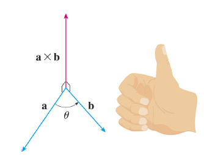
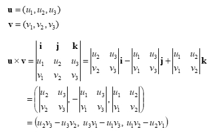

# Mathematics
## [Index](#index)
* [Outer Product](#outer-product)
* [Permutation and Combination](#permutation-and-combination)
---

## Outer Product
* 추천 문제
    * [[BOJ] CCW](https://www.acmicpc.net/problem/11758) [(소스코드)](./ccw/ccw.cpp)
    * [[BOJ] 다각형의 면적](https://www.acmicpc.net/problem/2166) [(소스코드)](./src/polygon.cpp)
    * [[BOJ] 선분 교차 1](https://www.acmicpc.net/problem/17386) [(소스코드)](./src/line1.cpp)
    * [[BOJ] 선분 교차 2](https://www.acmicpc.net/problem/17387) [(소스코드)](./src/line2.cpp)

### CCW(CounterClockWise)
* 벡터의 외적을 이용하면 평면위에 위치한 세 점의 방향성을 판별할 수 있음
* 두 벡터 $\overrightarrow{u}$, $\overrightarrow{v}$가 주어졌을때 $\overrightarrow{u}$, $\overrightarrow{v}$가 이루는 각을 $\theta$, $\overrightarrow{u}$, $\overrightarrow{v}$ 에 수직인 단위벡터를 $\overrightarrow{n}$라 하자. 이때 두 벡터의 외적은 아래와 같음
    > $\overrightarrow{u}$ $\times$ $\overrightarrow{v}$ = (| $\overrightarrow{u}$ || $\overrightarrow{v}$ | $\sin$ $\theta$ ) $\overrightarrow{n}$ &nbsp;&nbsp;( 0 ≤ $\theta$ ≤ $\pi$ )
    * $\theta$의 범위가 한정됨에 따라, 계산 결과의 부호는 단위벡터 $\overrightarrow{n}$에 의해 결정

* 단위벡터 $\overrightarrow{n}$의 방향 결정
    * 반시계 방향이면 양수, 시계 방향이면 음수

    

* 외적의 행렬 표현을 이용한 계산

    

    * 평면위에 놓인 세 점이므로, <i>u</i>3와 <i>v</i>3는 둘 다 0
    * 행렬 표현식의 계산 결과는 <i>u</i>1<i>v</i>2−<i>u</i>2<i>u</i>1
    * <b><i>u</i>1<i>v</i>2−<i>u</i>2<i>u</i>1<b>의 계산 결과가 양수라면 반시계 방향, 음수라면 시계 방향</b>

### 다각형의 면접

### [Top](#index)
---
## Permutation and Combination

### [Top](#index)
---

## [WIP] 큰 수 계산
* `long long` 형의 값 표현 범위를 벗어나는 경우, `string` 형을 사용해 큰 수 계산을 구현하거나, 카라추바 또는 FFT(Fast Fourier Transform)을 사용해야 함
* 추천 문제
    * [조합](https://www.acmicpc.net/problem/2407)
    * [큰 수 곱셈](https://www.acmicpc.net/problem/13277)
