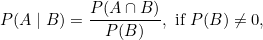
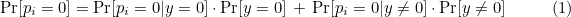

# Mathematics
## Index
* [[WIP] Big Integer](#big-integer)
* [Binomial Coefficient](#binomial-coefficient)
* [[WIP] Convex Hull](#convex-hull)
* [Count All Numbers with Unique Digits in a Given Range](#count-all-numbers-with-unique-digits-in-a-given-range)
* [Freivalds' Algorithm](#freivalds-algorithm)
* [GCD & LCM](#gcd--lcm)
* [[WIP] Lucas's Theorem](#lucass-theorem)
* [Modulo](#modulo)
* [[WIP] Outer Product](#outer-product) - 내용 보강해야 함
* [Permutation and Combination](#permutation-and-combination)
* [Prime Number](#prime-number)
---

## Big Integer
* 추천 문제
    * [[BOJ] 조합](https://www.acmicpc.net/problem/2407) - WIP
    * [[BOJ] 큰 수 곱셈](https://www.acmicpc.net/problem/13277) - WIP
---

* `long long` 형의 값 표현 범위를 벗어나는 경우, `string` 형을 사용해 큰 수 계산을 구현하거나, 카라추바 또는 FFT(Fast Fourier Transform)을 사용해야 함

### [Top](#index)
---

## Binomial Coefficient
* 추천 문제
    * [[BOJ] 이항 계수 1](https://www.acmicpc.net/problem/11050) [(소스코드)](./binomial-coefficient/src/1.cpp)
    * [[BOJ] 이항 계수 2](https://www.acmicpc.net/problem/11051) [(소스코드)](./binomial-coefficient/src/1.cpp)
    * [[BOJ] 이항 계수 3](https://www.acmicpc.net/problem/11401) - WIP
    * [[BOJ] 이항 계수 4](https://www.acmicpc.net/problem/11402) - WIP
    * [[BOJ] 이항 계수 5](https://www.acmicpc.net/problem/11439) - WIP
    * [[BOJ] 이항 계수 6](https://www.acmicpc.net/problem/14854) - WIP
---


* 자연수 <i>n</i> 및 정수 <i>k</i>가 주어졌을 때, 이항계수는 다음과 같음

    

* 이항계수는 다음과 같은 항등식을 만족함

    

    


### [Top](#index)
---

## Convex Hull
* 추천 문제
    * [[BOJ] 볼록 껍질](https://www.acmicpc.net/problem/1708) [(소스코드)](./convex-hull/src/convex_hull.cc)
    * [[BOJ] Highway](https://www.acmicpc.net/problem/10254) [(소스코드)](./convex-hull/src/highway.cc) - Convex Hull + Rotating Calipers, WIP
---

1. 2차원 평면 상에 좌표 <i>x</i>, <i>y</i>가 주어질 때, <i>y</i> 좌표를 기준으로 오름차순 정렬하되, <i>y</i> 좌표가 동일하다면 <i>x</i> 좌표를 기준으로 오름차순 정렬한다.
2. 기준 좌표(보통 0 번째 좌표를 기준으로 삼는다)를 기준으로 반시계 방향으로 정렬한다. 
    * [CCW](#ccwcounterclockwise) 알고리즘을 사용했을 때 양수는 반시계 방향, 음수는 시계 방향을 나타냄
    * 만약 0이 나온다면, 기준 좌표로부터 가까운 거리 순으로 정렬
3. 컨벡스 헐 알고리즘([Graham's Scan](https://en.wikipedia.org/wiki/Graham_scan))을 사용해 외곽 좌표를 찾는다.

### [Top](#index)
---

## Count All Numbers with Unique Digits in a Given Range
* 추천 문제
    * [[BOJ] 책 페이지](https://www.acmicpc.net/problem/1019) [(소스코드)](./count-all-numbers/src/page.cpp)
    * [[BOJ] 합](https://www.acmicpc.net/problem/1081) [(소스코드)](./count-all-numbers/src/sum.cpp)
---
* 만약 두 수 `1345`, `8742`가 주어졌을 때, 두 수 사이에 등장할 수 있는 숫자가 몇 개인지 판별하기 위해, 아래 과정을 거친다:
1. 주어진 두 수 중에서 시작 값의 일의 자리를 0으로, 끝 값의 일이 자리를 9로 설정한다. 이 과정에서 등장하는 수는 직접 계산한다.
    * 이를테면, `1345`는 `1350`, `8742`는 `8739`로 설정한다.
2. 시작 값의 일의 자리를 0, 끝 값의 일의 자리를 9로 설정하면 아래와 같은 규칙을 이용할 수 있다:

    

3. 일의 자리부터 주어진 숫자의 자리까지 위 단계를 반복한다. 

```cpp
vector<long long> get_freq(long long end)
{
    static const int base = 10;
    long long start = 1;
    long long pos = 1;

    vector<long long> freq(base);
    while (start<=end) {
        while (start%base!=0 && start<=end) {
            int n = start;
            while (n>0) {
                freq[n%base]+=pos;
                n/=base;
            }
            ++start;
        }
        if (start>end) {
            break;
        }
        while (end%base!=9 && start<=end) {
            int n = end;
            while (n>0) {
                freq[n%base]+=pos;
                n/=base;
            }
            --end;
        }

        start/=base;
        end/=base;
        long long cnt = end-start+1;
        for (int i = 0; i<base; ++i) {
            freq[i]+=cnt*pos;
        }
        pos*=10;
    }

    return freq;
}
```

### [Top](#index)
---

## [Freivalds' Algorithm](https://en.wikipedia.org/wiki/Freivalds%27_algorithm)
* 추천 문제
    * [[CodeForces] Matrix God](http://codeforces.com/gym/101341/problem/I) [(소스코드)](./freivalds-algorithm/src/freivalds.cpp)
---

### 프리발즈 알고리즘(Freivalds' algorithm)이란?
* 행렬곱을 검증하기 위해 사용하는 <b>probabilistic randomized algorithm</b>이다. 
    * 세 개의 <i>n</i> × <i>n</i> 행렬 <i>A</i>, <i>B</i>, 그리고 <i>C</i>가 주어졌을 때, 행렬곱 <i>A</i> × <i>B</i> = <i>C</i>를 검증하기 위한 일반적인 방법은 <i>A</i> × <i>B</i>의 결과와 <i>C</i>를 비교하면 된다. 
    * 위 방법의 문제점은 <b>시간복잡도가 크다</b>는 데 있다. (일반적인 행렬곱 시간복잡도는 <b>O(<i>n</i><sup>3</sup>)</b>)
        ```
        input A and B, both n by n matrices
        initialize C to be an n by n matrix of all zeros
        for i from 1 to n:
            for j from 1 to n:
                for k from 1 to n:
                    C[i][j] = C[i][j] + A[i][k]*B[k][j]
        output C (as A*B)
        ```
    * 지금까지 알려진 [가장 효율적인 행렬곱 알고리즘](https://en.wikipedia.org/wiki/Computational_complexity_of_matrix_multiplication)의 시간복잡도는 <b>O(<i>n</i><sup>2.3728596</sup>)</b>이다. 
    * Freivalds' algorithm을 사용하면 <b>randomization</b>을 이용해 <b>높은 확률</b>로 시간복잡도를 <b>O(<i>n</i><sup>2</sup>)</b>까지 낮출 수 있다. 
        * <b>O(<i>kn</i><sup>3</sup>)</b> 번 알고리즘을 수행하면, 행렬곱 검증 시 실패 확률 2<sup>-<i>k</i></sup> 미만으로 행렬곱 검증을 수행할 수 있다.

### 알고리즘 구조
* 입력(input)
    * 세 개의 <i>n</i> × <i>n</i> 행렬 <i>A</i>, <i>B</i>, <i>C</i>

* 출력(output)
    * <i>A</i> × <i>B</i> = <i>C</i>이라면 `true`, 아니라면 `false`

* 과정(procedure)
1. 0과 1로 이루어진 <i>n</i> × <i>1</i> 크기의 random vector <i>r</i>생성
2. 다음과 같이 계산해 벡터를 구함:

    

3. 결과가  이라면 `true`, 그렇지 않으면 `false` 반환

* 오류(error)
    * 만약 <i>A</i> × <i>B</i> = <i>C</i>라면 이 알고리즘은 항상 `true`를 반환한다.
    * 만약 <i>A</i> × <i>B</i> ≠ <i>C</i>라면 `true`를 반환할 확률(연산 결과가 zero vector가 되는 경우)은 절반 또는 그보다 낮다. 
        * [one-sided error](https://en.wikipedia.org/wiki/Monte_Carlo_algorithm#One-sided_vs_two-sided_error)
        * <i>n</i>이 2라면, random vector의 경우의 수는 4가지((0 0)<sup><i>T</i></sup>, (0 1)<sup><i>T</i></sup>, (1 0)<sup><i>T</i></sup>, (1 1)<sup><i>T</i></sup>이며, 이 경우들 중에서 `true`가 나올 경우는 절반이거나 이보다 낮을 수 있다. 아래 예를 보자:

            
        
        * 위 경우에서  결과가 zero vector인 경우(즉, `false`임에도 불구하고 `true`가 나오는 경우, 틀린 결과를 반환하는 경우)는 random vector <i>r</i>이 (0 0)<sup><i>T</i></sup> 또는 (1 1)<sup><i>T</i></sup>일 경우이다. (1/2 확률)
        * 만약 random vector 생성 기회가 2 번 주어진다면, 1/2<sup>2</sup> 확률로 잘못된 결과를 반환한다. 
        * 정리하면, 일반적인 상황에서 zero vector가 나올 수 있는 확률은 절반 혹은 그보다 낮으며, 시행회수를 늘리면(예를 들면 20번 수행) 행렬곱 검증 실패 확률이 확연히 낮아진다. (0.00000095)
        * 이 알고리즘을 <i>k</i> 번 반복한다고 가정하자. 이때 매 회 알고리즘을 돌릴 때마다 유도되는 결과가 zero vector인 경우에만 `true`를 반환한다면, 실행 시간은 <b>O(<i>kn</i><sup>2</sup>)</b>가 되고, 오류가 발견될 확률은 2<sup>-<i>k</i></sup>보다 낮거나 같다.

### 오류 분석(error analysis)
#### Let <i>p</i> equal the probability of error. We claim that if <i>A</i> × <i>B</i> = <i>C</i>, then <i>p</i> = 0, and if <i>A</i> × <i>B</i> ≠ <i>C</i>, then <i>p</i> ≤ 1/2.
* Case <i>A</i> × <i>B</i> = <i>C</i>
    * 오류가 날 확률이 없음

        


* Case <i>A</i> × <i>B</i> ≠ <i>C</i>
    * <i>D</i>를 다음과 같이 정의해 보자. 

        

        * <i>D</i>는 zero matrix가 아니며, 이는 <i>d</i><sub><i>i</i>,<i>j</i></sub> 중에서 0이 아닌 원소가 존재한다는 뜻이다.
        * 우리가 찾고자 하는 것은 <i>D</i>가 zero matrix가 아니면서 <i>Dr</i>이 zero vector인 경우이며, 이를 통해 오류가 발생할 확률을 찾아야 한다.
    
    * <i>Dr</i>이 zero vector이면서 <i>d<sub>ij</sub></i>가 0이 아닐 때, 확률 벡터의 원소는 아래와 같이 계산할 수 있다:

        

        * 확률 벡터의 모든 원소 <i>p<sub>i</sub></i>가 0이 되어야 한다.
        * 위 식에서 상수 <i>y</i>는 0일 수도, 0이 아닐 수도 있다. 따라서 <i>y</i>에 대한 조건부 확률을 계산해야 한다.
        * [Bayes' Theorem:](https://en.wikipedia.org/wiki/Bayes%27_theorem)

            
    
    * <i>y</i>를 기준으로 식을 분해하면 다음과 같으며, 이를 식 (1)로 둔다:

        

        * 확률 벡터의 모든 원소가 0이 될 확률은 <b><i>p<sub>i</sub></i>가 0이면서 동시에 <i>y</i>가 0일 때의 확률</b>과 <b><i>p<sub>i</sub></i>가 0이면서 동시에 <i>y</i>가 0이 아닐 때의 확률</b>을 더한 값이다.

    * 다음 식을 활용해 식(1)을 수치화할 수 있다:

        

        * <i>y</i>가 0일 때 <i>p<sub>i</sub></i>가 0이 되는 경우는 random vector 원소 <i>r<sub>j</sub></i>가 0이 될 때이므로, 해당 경우에서의 확률은 1/2다.
        * <i>y</i>가 0이 아닐 때 <i>p<sub>i</sub></i>가 0이 되는 경우는 random vector 원소 <i>r<sub>j</sub></i>가 1이 될 때이면서 동시에 <i>d<sub>ij</sub></i>가 -<i>y</i>가 되는 경우이다. 이 경우에서의 확률은 <i>r<sub>j</sub></i>가 1이 되는 확률인 1/2보다 작거나 같다. 
            * <i>d<sub>ij</sub></i>가 항상 -<i>y</i>가 나온다고 해도 <i>r<sub>j</sub></i>가 1이 나와야 하므로, 해당 경우에서의 확률은 1/2보다 높게 나올 수 없다. 
        
    * 수치화한 결과들을 식(1)에 대입하면 아래와 같다:

        
    
    * 결국, 오류가 발생하는 최대 확률은 아래 식으로 유도된다:

        

### [Top](#index)
---

## GCD & LCM
* 추천 문제
    * [[BOJ] Cain Calendar](https://www.acmicpc.net/problem/6064) [(소스코드)](./gcd--lcm/src/cain.cpp)
---

* 최대공약수(Greatest Common Divisor, GCD)
    * 두 수, 혹은 그 이상의 여러 수의 <b>공통인 약수</b>
    * 두 수 <i>a</i>, <i>b</i>의 최대공약수를 수학적 기호로 표시하면 gcd(<i>a</i>,<i>b</i>)이며, gcd(<i>a</i>,<i>b</i>) = 1이면 두 수 <i>a</i>, <i>b</i>는 서로소(relatively prime)
    * (<i>a</i>, <i>b</i>)로 표기하기도 함 
    * 유클리드 호제법(Euclidean algorithm)을 이용하면 두 수의 최대공약수 계산 가능

    

    * 유클리드 호제법
        * 두 양의 정수 <i>a</i>, <i>b</i> (<i>a</i> > <i>b</i>)에 대하여 <i>a</i> = <i>bq</i> + <i>r</i> (0 ≤ <i>r</i> < <i>b</i>)라 하면, <i>a</i>, <i>b</i>의 최대공약수는 <i>b</i>, <i>r</i>의 최대공약수와 같다. 
        * gcd(<i>a</i>, <i>b</i>) = gcd(<i>b</i>, <i>r</i>)
        * <i>r</i> = 0이라면, <i>a</i>, <i>b</i>의 최대공약수는 <i>b</i>가 된다. 
    ```c++
    int gcd(int a, int b)
    {
        
        return ((b==0) ? a : gcd(b,a%b));
    }
    ```

* 최소공배수(Least Common Multiple, LCM)
    * 두 수, 혹은 그 이상의 여러 수의 <b>공통인 배수</b>
    * 두 수 <i>a</i>, <i>b</i>의 최소공배수를 수학적 기호로 표시하면 lcm(<i>a</i>,<i>b</i>)
    * [<i>a</i>, <i>b</i>]로 표기하기도 함 
    * 최대공약수를 이용한 최소공배수 계산:
        * <i>a</i> × <i>b</i> = gcd(<i>a</i>, <i>b</i>) × lcm(<i>a</i>, <i>b</i>)
        * <i>a</i> × <i>b</i> ÷ gcd(<i>a</i>, <i>b</i>) = lcm(<i>a</i>, <i>b</i>)

    ```c++
    int gcd(int, int);

    int lcm(int a, int b)
    {
        
        return a/gcd(a,b)*b; // escape overflow
    }
    ```

### [Top](#index)
---

## Lucas's Theorem

### [Top](#index)
---

## Modulo
* 추천 문제
    * [[BOJ] 곱셈](https://www.acmicpc.net/problem/1629) [(소스코드)](./modulo/src/mul.cpp)
---

* Given <b>two positive numbers</b> <i>a</i> and <i>n</i>, <i>a</i> modulo <i>n</i> (abbreviated as <i>a</i> <b>mod</b> <i>n</i>) is the remainder of the Euclidean division of <i>a</i> by <i>n</i>, where <i>a</i> is the <b>dividend</b> and <i>n</i> is the <b>divisor</b>. 
* The range of numbers for an integer modulo of <i>n</i> is 0 to <i>n</i> − 1 inclusive (<i>a</i> <b>mod</b> 1 is always 0; <i>a</i> <b>mod</b> 0 is <b>undefined</b>, possibly resulting in <b>a division by zero error</b> in some programming languages).

### Distributive Property
#### Modular Addition 
`(A + B) mod C = (A mod C + B mod C) mod C`
```c++
    int A = 14;
    int B = 17;
    int C = 5;

    // operator precedence
    // * / % -> + -
    cout << (A+B)%C << '\n'; // 1
    cout << (A%C+B%C)%C << '\n'; // 1
```

><b>(A + B) mod C = (A mod C + B mod C) mod C</b><br><br>
<b>A</b> = C * Q1 + R1 where 0 ≤ R1 < C and Q1 is some integer. <b>A mod C = R1</b><br>
<b>B</b> = C * Q2 + R2 where 0 ≤ R2 < C and Q2 is some integer. <b>B mod C = R2</b><br>
<b>(A + B) = C * (Q1 + Q2) + R1+R2</b><br><br>
<b>LHS</b> = (A + B) mod C<br>
<b>LHS</b> = (C * (Q1 + Q2) + R1+ R2) mod C<br>
We can eliminate the multiples of C when we take the mod C<br>
<b>LHS = (R1 + R2) mod C</b><br><br>
<b>RHS</b> = (A mod C + B mod C) mod C<br>
<b>RHS = (R1 + R2) mod C</b><br><br>
<b>LHS=RHS= (R1 + R2) mod C</b>

#### Modular Subtraction
`(A - B) mod C = (A mod C - B mod C) mod C`
```c++
    int A = 14;
    int B = 11;
    int C = 7;

    // operator precedence
    // * / % -> + -
    cout << (A-B)%C << '\n'; // 3 
    cout << (A%C-B%C)%C << '\n'; // -4
    // a dividend can't be negative
    // A%C: 0
    // B%C: 4
    // A%C-B%C: -4
    // so, add a divisor
    cout << (A%C-B%C+C)%C << '\n'; // 3
```

#### Modular Multiplication
`(A * B) mod C = (A mod C * B mod C) mod C`
```c++
    int A = 4;
    int B = 7;
    int C = 6;

    // operator precedence
    // * / % -> + -
    cout << (A*B)%C << '\n'; // 4
    cout << (A%C*B%C)%C << '\n'; // 4
```

#### ~~Modular Multiplication~~(NOT allow)
<br>

### Fast Modular Exponentiation
`A^2 mod C = (A * A) mod C = ((A mod C) * (A mod C)) mod C`
>7<sup>1</sup> <b>mod</b> 13 = 7<br><br>
7<sup>2</sup> <b>mod</b> 13<br>
= (7<sup>1</sup> * 7<sup>1</sup>) <b>mod</b> 13<br>
= (7<sup>1</sup> <b>mod</b> 13 * 7<sup>1</sup> <b>mod</b> 13) <b>mod</b> 13<br><br>
7<sup>4</sup> <b>mod</b> 13<br>
= (7<sup>2</sup> * 7<sup>2</sup>) <b>mod</b> 13<br>
= (7<sup>2</sup> <b>mod</b> 13 * 7<sup>2</sup> <b>mod</b> 13) <b>mod</b> 13<br><br>
...

#### ex. 10<sup>11</sup> <b>mod</b> 12
```c++
#include <bits/stdc++.h>

using namespace std;

long long pow(long long, long long, long long);

int main(void)
{
    ios::sync_with_stdio(false);
    cin.tie(NULL);

    long long a, b, c;
    cin>>a>>b>>c;
    cout << pow(a,b,c);

    return 0;
}

long long pow(long long a, long long b, long long c)
{
    if (b==1) {

        return a%c;
    }

    long long val = pow(a,b/2,c);
    val = val*val%c;

    return (b&01) ? (val*a%c)%c : val;
}
```

### [Top](#index)
---

## Outer Product
* 추천 문제
    * [[BOJ] CCW](https://www.acmicpc.net/problem/11758) [(소스코드)](./outer-product/src/ccw.cpp)
    * [[BOJ] 다각형의 면적](https://www.acmicpc.net/problem/2166) [(소스코드)](./outer-product/src/polygon.cpp)
    * [[BOJ] 선분 교차 1](https://www.acmicpc.net/problem/17386) [(소스코드)](./outer-product/src/line1.cpp)
    * [[BOJ] 선분 교차 2](https://www.acmicpc.net/problem/17387) [(소스코드)](./outer-product/src/line2.cpp)
---

### CCW(CounterClockWise)
* 벡터의 외적을 이용하면 평면위에 위치한 세 점의 방향성을 판별할 수 있음
* 두 벡터 <i>u</i>, <i>v</i>가 주어졌을 때, 벡터 <i>u</i>, <i>v</i>가 이루는 각이 <i>θ</i>, 벡터 <i>u</i>, <i>v</i>에 수직인 단위벡터가 <i>n</i>이면 두 벡터의 외적은 아래와 같음:<br>
    
    * <i>θ</i>의 범위가 한정됨에 따라, 계산 결과의 부호는 단위벡터 <i>n</i>에 의해 결정

* 단위벡터 <i>n</i>의 방향 결정
    * 반시계 방향이면 양수, 시계 방향이면 음수

    

* 외적의 행렬 표현을 이용한 계산

    

    * 평면위에 놓인 세 점이므로, <i>u</i><sub>3</sub>와 <i>v</i><sub>3</sub>는 둘 다 0
    * 행렬 표현식의 계산 결과는 <i>u</i><sub>1</sub><i>v</i><sub>2</sub>−<i>u</i><sub>2</sub><i>u</i><sub>1</sub>
    * <b><i>u</i><sub>1</sub><i>v</i><sub>2</sub>−<i>u</i><sub>2</sub><i>u</i><sub>1</sub>의 계산 결과가 양수라면 반시계 방향, 음수라면 시계 방향</b>


### 다각형의 면접


### [Top](#index)
---

## Permutation and Combination
* 추천 문제
    * [[BOJ] 다음 순열](https://www.acmicpc.net/problem/10972) [(소스코드)](./permutation-and-combination/src/next.cpp) - `next_permutation` 용법
    * [[BOJ] 이전 순열](https://www.acmicpc.net/problem/10973) [(소스코드)](./permutation-and-combination/src/prev.cpp) - `prev_permutation` 용법

### Permutation 


```c++
// https://www.acmicpc.net/problem/15654
#include <bits/stdc++.h>

using namespace std;

int main(void)
{
    ios::sync_with_stdio(false);
    cin.tie(NULL);

    // nPm
    int n, m;
    cin>>n>>m;
    vector<int> v;

    for (int i = 0; i<n; ++i) {
        int temp;
        cin>>temp;

        v.push_back(temp);
    }
    sort(v.begin(),v.end());

    do {
        for (int i = 0; i<m; ++i) {
            cout << v[i] << ' ';
        }
        cout << '\n';
        // 1 2 3 4 5 -> 1 2 5 4 3, 1 3 2 4 5 -> 1 3 5 4 2, ...
        reverse(v.begin()+m,v.end());
    } while (next_permutation(v.begin(),v.end()));

    return 0;
}
```

### Combination 


```c++
// https://www.acmicpc.net/problem/15650
#include <bits/stdc++.h>

using namespace std;

int main(void)
{
    ios::sync_with_stdio(false);
    cin.tie(NULL);

    // nCm
    int n, m;
    cin>>n>>m;
    int arr[8];
    for (int i = 0; i<n; ++i) {
        arr[i]=i+1;
    }
    vector<int> v;

    // next_permutation, 0 0 1 1 => 1 1 0 0
    // prev_permutation, 1 1 0 0 => 0 0 1 1
    for (int i = 0; i<m; ++i) {
        v.push_back(0);
    }
    for (int i = m; i<n; ++i) {
        v.push_back(1);
    }
    do {
        for (int i = 0; i<n; ++i) {
            if (!v[i]) {
                cout << arr[i] << ' ';
            }
        }
        cout << '\n';
    } while (next_permutation(v.begin(),v.end()));

    return 0;
}
```

### [Top](#index)
---

## Prime Number

* 소수 판정법

    

    * 1과 자기 자신으로만 나누어 지는 수(약수가 2개인 수)
    * 1이 아닌 양의 정수 <i>n</i>이 주어졌을 때, 2부터 <i>n</i>-1까지의 수로 나누어지지 않는 수(<b>1은 소수가 아님에 주의</b>)
    * 시간복잡도 <b>O(<i>n</i>)</b>
    ```c++
    bool is_prime(int n)
    {
        if (n==1) { // 1 is not a prime number

            return false;
        }
        for (int i = 2; i<n; ++i) {
            if (n%i==0) { // none of the numbers 
                          // 2, 3, ... n-1 divides n evenly

                return false;
            }
        }

        return true;
    }
    ```

    * 합성수 <i>n</i>이 주어졌을 때, 1을 제외한 가장 작은 약수는 √<i>n</i> 이하라는 성질을 이용하면, 시간복잡도를 <b>(√<i>n</i>)</b>까지 낮출 수 있음
        * 합성수 <i>n</i>에서 1을 제외한 가장 작은 약수가 <i>x</i>라면, <i>n</i>/<i>x</i>는 1이 아닌 <i>n</i>의 약수가 된다.
            * 예를 들어, <i>n</i>이 4라면, 1이 아닌 가장 작은 약수 <i>x</i>는 2가 되고, <i>n</i>/<i>x</i> 결과는 2다.
            * 예를 들어, <i>n</i>이 6라면, 1이 아닌 가장 작은 약수 <i>x</i>는 2가 되고, <i>n</i>/<i>x</i> 결과는 3이다.
            * 따라서 식이 다음과 같이 유도된다:
                * <i>x</i> ≤ <i>n</i>/<i>x</i>
                * <i>x</i>가 1이 아닌 가장 작은 약수라고 정의했으므로, <i>x</i> > <i>n</i>/<i>x</i>가 된다면 이는 모순이다.
        * 유도된 식에서 우변의 분모 <i>x</i>를 좌변으로 옮기면 x<sup>2</sup> ≤ <i>n</i>이므로 <i>x</i> ≤ √<i>n</i>가 된다. 
    * 위 증명을 응용하면, 2부터 √<i>n</i>까지의 수로 나누어지지 않으면 1과 <i>n</i>이외의 약수가 존재하지 않으므로 소수임을 알 수 있음
    ```c++
    bool is_prime(int n)
    {
        if (n==1) { // 1 is not a prime number

            return false;
        }
        for (int i = 2; i*i<=n; ++i) {
            if (n%i==0) { // none of the numbers 
                          // 2, 3, ... √n divides n evenly

                return false;
            }
        }

        return true;
    }
    ```
    * 에라토스테네스의 체(Sieve of Eratosthenes)를 사용하면, 즉 합성수의 성질을 이용하면 범위 내에서의 소수 판정을 빠르게 처리할 수 있음

    

    * 불필요한 연산을 생략할 수 있어 범위 내에 존재하는 소수를 빠르게 찾을 수 있음
    ```c++
    vector<int> eratosthenes_sieve(int from, int to) 
    {
        static vector<bool> is_composition(to+1); // 1-based
        vector<int> primes;

        if (from<2) { // 1 is not a prime number
            from=2;
        }
        for (int i = 2; i*i<=to; ++i) {
            if (is_composition[i]) {
                continue;
            }
            for (int j = i*i; j<=to; j+=i) {
                is_composition[j]=true;
            }
        }
        for (int i = from; i<=to; ++i) {
            if (!is_composition[i]) {
                primes.push_back(i);
            }
        }

        return primes;
    }
    ```

    * 소인수분해의 성질
        * <b>[정수론의 기본 정리](https://ko.wikipedia.org/wiki/%EC%82%B0%EC%88%A0%EC%9D%98_%EA%B8%B0%EB%B3%B8_%EC%A0%95%EB%A6%AC)에 의해, 모든 자연수는 꼭 한가지 방법으로 소수의 곱으로 표현할 수 있고 이를 소인수 분해의 일의성이라고 한다.</b>
    
    ```c++
    void prime_factorization(int n)
    {
        for (int i = 2; i*i<=n; ++i) { // 1 is not a prime number
            while (n%i==0) {
                cout << i << '\n';
                n/=i;
            }
        }
        if (n>1) {
            cout << n; 
        }

        return;
    }
    ```

### [Top](#index)
---