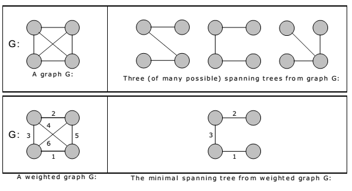
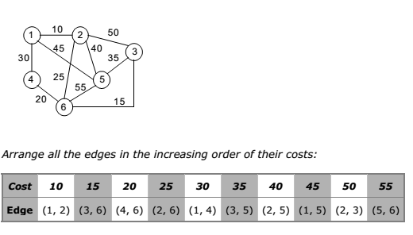
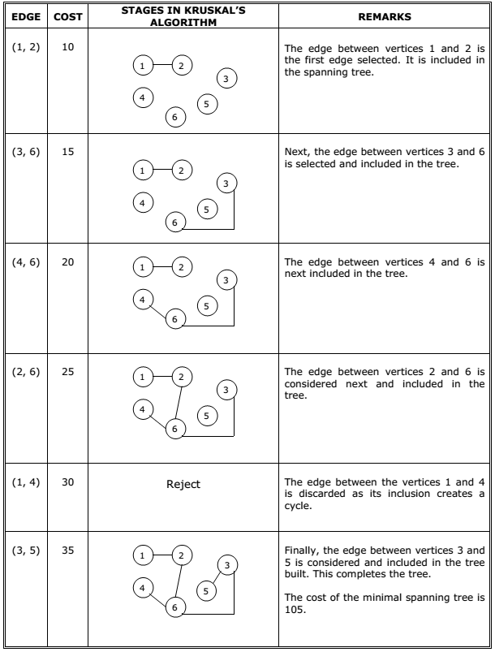
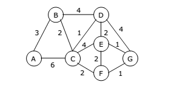
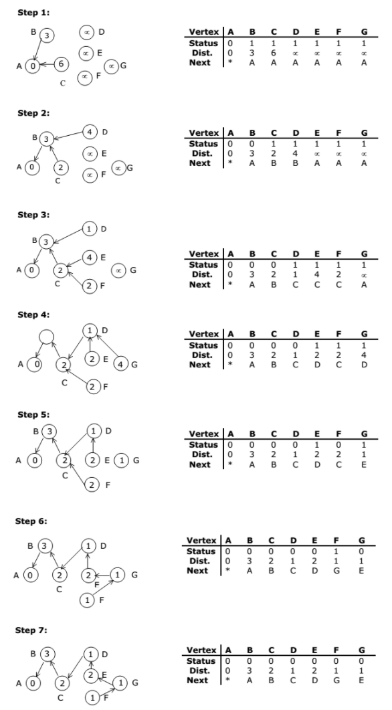

# Minimum Spanning Tree
* 추천 문제
    * [[BOJ] Freckles](https://www.acmicpc.net/problem/4386) [(소스코드)](./src/freckle.cpp) - WIP
    * [[BOJ] 네트워크 연결](https://www.acmicpc.net/problem/1922) [(소스코드)](./src/network.cpp) - WIP
    * [[BOJ] Dark roads](https://www.acmicpc.net/problem/6497) [(소스코드)](./src/dark_road.cpp) - WIP
    * [[BOJ] 다리 만들기 2](https://www.acmicpc.net/problem/17472) [(소스코드)](./src/bridge.cpp) - WIP
---

## 최소 신장 트리(MST)
* 신장 트리(Spanning Tree)
    * 트리는 사이클이 없는 무방향 그래프(Undirected Acyclic Connected Graph)
    * 트리 <i>T</i>가 그래프 <i>G</i>의 모든 정점을 포함하는 부분 그래프이자 트리라면, <i>T</i>는 <i>G</i>의 신장 트리
    * 트리의 성질에 의해 그래프의 정점이 <i>V</i>개라면, 신장 트리는 <i>V</i>-1 개의 간선을 갖게 됨

* 최소 신장 트리(Minimum Spanning Tree)
    * 신장 트리 중에서 간선의 합이 최소인 트리
    * 신장 트리를 구할 수 있는 알고리즘은 크루스칼 알고리즘과 프림 알고리즘이 있음



## 크루스칼 알고리즘(Kruskal's algorithm)
* 간선의 비용을 오름차순으로 정렬해 가장 낮은 비용의 간선을 선택
* 선택한 간선의 두 정점이 같은 그룹이라면 다음 간선을 선택하고, 그렇지 않다면 두 정점을 같은 그룹으로 묶은 뒤 해당 간선을 최소 신장 트리에 추가함
* 최소 신장 트리에 추가된 간선의 개수가 <i>V</i>-1 개가 될 때까지 위 과정 반복
* 시간복잡도는 <b>O(<i>E</i> log <i>E</i>)</b>





### 연습문제
* [[BOJ] 최소 스패닝 트리](https://www.acmicpc.net/problem/1197) [(소스코드)](./src/kruskal.cpp) - 크루스칼 알고리즘 사용
###### Memory:  KB, Time:  ms
```c++
#include <bits/stdc++.h>

using namespace std;

int find(int);
void merge(int, int);

vector<int> parent, level;

int main(void) 
{
    ios::sync_with_stdio(false);
    cin.tie(NULL);

    int v, e;
    cin>>v>>e;
    for (int i = 0; i<=v; ++i) {
        parent.push_back(i);
        level.push_back(1);
    }
    vector<pair<int, pair<int, int>>> edge(e);
    for (int i = 0; i<e; ++i) {
        cin>>edge[i].second.first>>edge[i].second.second>>edge[i].first;
    }

    sort(edge.begin(),edge.end());
    int cnt = 0;
    int res = 0;
    for (int i = 0; i<e; ++i) {
        if (cnt==v-1) {
            break;
        }

        int cost = edge[i].first;
        int v1 = edge[i].second.first;
        int v2 = edge[i].second.second;

        if (find(v1)==find(v2)) {
            continue;
        }
        merge(v1,v2);
        ++cnt;
        res+=cost;
    }
    cout << res;

    return 0;
}

int find(int u)
{
    if (u==parent[u]) {
        
        return u;
    }

    return parent[u]=find(parent[u]);
}

void merge(int u, int v)
{
    u=find(u); 
    v=find(v); 
    if (u==v) {
        
        return; 
    }
    if (level[u]>level[v]) {
        swap(u,v); 
    }
    parent[u]=v;
    if (level[u]==level[v]) {
        ++level[v]; 
    }

    return;
}
```

## 프림 알고리즘(Prim's algorithm)
* 임의의 정점을 선택해 최소 신장 트리에 추가하고, 해당 정점과 연결된 모든 간선을 `heap`에 추가함
* `heap`에서 비용이 가장 작은 간선을 꺼냄
    * 만약 해당 간선이 최소 신장 트리에 포함되어 있는 두 정점을 연결한다면 다음 간선을 꺼냄
    * 만약 해당 간선이 최소 신장 트리에 포함되어 있는 정점 <i>u</i>와 포함되지 않은 정점 <i>v</i>를 연결한다면, <i>v</i>를 최소 신장 트리에 추가함
* 최소 신장 트리에 추가된 간선의 개수가 <i>V</i>-1 개가 될 때까지 위 과정 반복
* 시간복잡도는 <b>O(<i>E</i> log <i>E</i>)</b>






### 연습문제
* [[BOJ] 최소 스패닝 트리](https://www.acmicpc.net/problem/1197) [(소스코드)](./src/prim.cpp) - 프림 알고리즘 사용
###### Memory:  KB, Time:  ms
```c++
```

---
|[이전 - Disjoint-set](/disjoint-set/)|[목록](https://github.com/RyanJeong/CP#index)|[다음 - Floyd-Warshall](/floyd-warshall/)|
|-|-|-|
