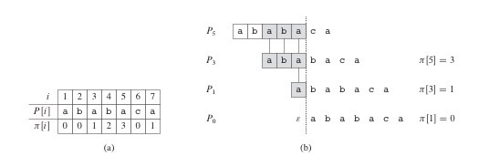

# [WIP] String
* 추천 문제 - 문자열
    * [[BOJ] IOIOI (IOIOI)](https://www.acmicpc.net/problem/5525) [(소스코드)](./src/ioioi.cpp) - 문자열 구현
    * [[BOJ] IZBORNIK](https://www.acmicpc.net/problem/1283) [(소스코드)](./src/izbornik.cpp) - `getline()`, `stringstream` 사용 방법
---

* 추천 문제 - KMP
    * [[BOJ] Editor](https://www.acmicpc.net/problem/1701) [(소스코드)](./src/editor.cpp) - KMP `fail`함수를 사용하는 문제
    * [[BOJ] 찾기](https://www.acmicpc.net/problem/1786) [(소스코드)](./src/kmp.cpp) - KMP 알고리즘 문제

---

## 문자열
* A string can be considered to be a vector of character values. Just as the subscript operator is used to obtain individual elements within a vector, in the same manner the subscript operator is used to access individual characters within strings. In addition, there are many high level operations specific to the string data type.

## [KMP](http://www.btechsmartclass.com/data_structures/knuth-morris-pratt-algorithm.html)
* 대상 문자열(`s`)로부터 패턴 문자열(`p`)의 포함 여부를 구하고자 할 때, `p`의 실패함수(`fail` or `pi`)를 구한 뒤, 이를 `s`에 적용
* 무식한 방법으로 `s`에 `p`의 포함 여부를 구하고자 할 때, `s`의 길이가 `n`, `p`의 길이가 `m`이라면 시간복잡도는 <b>O(<i>nm</i>)</b>
* KMP(Knuth-Morris-Pratt) 알고리즘을 적용하면 시간복잡도는 <b>O(<i>n</i>+<i>m</i>)</b>

### 실패함수(failure function)



### 실패함수 적용 예


### KMP 구현 코드
```cpp
#include <bits/stdc++.h>

using namespace std;

vector<int> get_fail(string);
vector<int> kmp(string, string);

/*
    failure function
    두 문자열의 일치 여부 확인 중 불일치하다면, 
    이동할 다음 idx를 가리키는 함수
    (prefix와 postfix가 일치하는 길이)

  STRING : B A B A B A A
  i      : 0 1 2 3 4 5 6 
  fail(i): 0 0 1 2 3 4 0
  ----------------------
  i = 6(A), j = 4(B) -> 2
  i = 6(A), j = 2(B) -> 0
  i = 6(A), j = 0(B) => 0
*/
vector<int> get_fail(string p)
{
    int n_p = p.size();
    vector<int> fail(n_p);
    for (int i = 1, j = 0; i<n_p; i++) {
        while (j>0 && p[i]!=p[j]) {
            j=fail[j-1]; // restore the idx
        }
        if (p[i]==p[j]) {
            fail[i]=j+1; // after j
            ++j;
        }
    }

    return fail;
}

vector<int> kmp(string s, string p)
{
    auto fail = get_fail(p);
    int n_s = (int)s.size();
    int n_p = (int)p.size();

    vector<int> ans;
    for (int i = 0, j = 0; i<n_s; i++) {
        while (j>0 && s[i]!=p[j]) {
            j=fail[j-1];
        }
        if (s[i]==p[j]) {
            if (j==n_p-1){
                ans.push_back(i-n_p+1);
/*
    ABC    => j = 0
    ABCABC => j = 3
*/
                j=fail[j];
            }
            else {
                j++;
            }
        }
    }

    return ans;
}
```

### 연습문제
* [[BOJ] 부분 문자열](https://www.acmicpc.net/problem/16916) [(소스코드)](./src/kmp_exam.cpp)
###### Memory: 11,476 KB, Time: 20 ms
```c++
#include <bits/stdc++.h>

using namespace std;

vector<int> get_fail(string);
vector<int> kmp(string, string);

int main(void)
{
    ios::sync_with_stdio(false);
    cin.tie(NULL);

    string s;
    getline(cin,s);
    string p;
    getline(cin,p);

    auto res = kmp(s,p);
    cout << (!res.empty());

    return 0;
}

vector<int> get_fail(string p)
{
    int n_p = p.size();
    vector<int> fail(n_p);
    for (int i = 1, j = 0; i<n_p; i++) {
        while (j>0 && p[i]!=p[j]) {
            j=fail[j-1];
        }
        if (p[i]==p[j]) {
            fail[i]=j+1;
            ++j;
        }
    }

    return fail;
}

vector<int> kmp(string s, string p)
{
    auto fail = get_fail(p);
    int n_s = (int)s.size();
    int n_p = (int)p.size();

    vector<int> ans;
    for (int i = 0, j = 0; i<n_s; i++) {
        while (j>0 && s[i]!=p[j]) {
            j=fail[j-1];
        }
        if (s[i]==p[j]) {
            if (j==n_p-1){
                ans.push_back(i-n_p+1);
                j=fail[j];
            }
            else {
                j++;
            }
        }
    }

    return ans;
}
```


## Trie - WIP

### 연습문제
* [[BOJ] ](https://www.acmicpc.net/problem/) [(소스코드)](./src/.cpp)
###### Memory:  KB, Time:  ms
```c++
```

---
|[이전 - Dijkstra](/dijkstra/)|[목록](https://github.com/RyanJeong/CP#index)|다음 - 없음|
|-|-|-|

