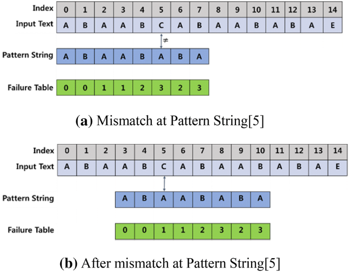

# [WIP] String
* 추천 문제 - 문자열
  * [[BOJ] 시간복잡도를 배운 도도](https://www.acmicpc.net/problem/24510) [(소스코드)](./src/time_complexity.cc) - `length()`의 반환 타입에 의해 오버플로우 발생을 주의해야 함
  * [[BOJ] IOIOI (IOIOI)](https://www.acmicpc.net/problem/5525) [(소스코드)](./src/ioioi.cc) - 문자열 구현
  * [[BOJ] Mirror, Mirror](https://www.acmicpc.net/problem/4740) [(소스코드)](./src/mirror.cpp) - `getline()`
  * [[BOJ] IZBORNIK](https://www.acmicpc.net/problem/1283) [(소스코드)](./src/izbornik.cpp) - `getline()`, `stringstream` 사용 방법
---

* 추천 문제 - KMP
  * [[BOJ] 카멜레온 부분 문자열](https://www.acmicpc.net/problem/13506) [(소스코드)](./src/chameleon.cc) - `fail` 함수의 동작을 이해할 수 있는 문제
  * [[BOJ] Editor](https://www.acmicpc.net/problem/1701) [(소스코드)](./src/editor.cpp) - KMP `fail`함수를 사용하는 문제 1
  * [[BOJ] Power Strings](https://www.acmicpc.net/problem/4354) [(소스코드)](./src/power_string.cpp) - KMP `fail`함수를 사용하는 문제 2
  * [[BOJ] 찾기](https://www.acmicpc.net/problem/1786) [(소스코드)](./src/kmp.cpp) - KMP 알고리즘 문제
---

* [WIP]추천 문제 - Trie
---

* [WIP]추천 문제 - 라빈 카프 알고리즘
---

* [WIP]추천 문제 - 아호코라식
---

* 추천 문제 - 접미사 배열
  * [[BOJ] Suffix Array](https://www.acmicpc.net/problem/9248) [(소스코드)](./src/sa.cc) - 접미사 배열 + LCP 구현문제
  * [[BOJ] DVAPUT](https://www.acmicpc.net/problem/3033) [(소스코드)](./src/dvaput.cc)
  * [[BOJ] 최장 공통 부분 문자열](https://www.acmicpc.net/problem/9249) [(소스코드)](./src/tlcpp.cc) - EOS(End of String, `$`)

---

## 문자열
* A string can be considered to be a vector of character values. Just as the subscript operator is used to obtain individual elements within a vector, in the same manner the subscript operator is used to access individual characters within strings. In addition, there are many high level operations specific to the string data type.

## [KMP](http://www.btechsmartclass.com/data_structures/knuth-morris-pratt-algorithm.html)
* 대상 문자열(`s`)로부터 패턴 문자열(`p`)의 포함 여부를 구하고자 할 때, `p`의 실패함수(`fail` or `pi`)를 구한 뒤, 이를 `s`에 적용
* 무식한 방법으로 `s`에 `p`의 포함 여부를 구하고자 할 때, `s`의 길이가 `n`, `p`의 길이가 `m`이라면 시간복잡도는 <b>O(<i>nm</i>)</b>
* KMP(Knuth-Morris-Pratt) 알고리즘을 적용하면 시간복잡도는 <b>O(<i>n</i>+<i>m</i>)</b>

### 실패함수(failure function)


  * 실패함수는 prefix와 suffix가 일치하는 가장 긴 문자열의 길이를 기록하는 함수
  * 예를 들어, 문자열 `BABABAA`가 있다면, 실패함수에 기록되는 값들은 다음과 같음:
    ```text
    index        : 0 1 2 3 4 5 6
    string       : B A B A B A A
    fail function: 0 0 1 2 3 4 0
    ```
    * `0`번 인덱스는 prefix와 suffix 길이가 둘 다 1이 될 수 없으므로, 0 기록
    * `1`번 인덱스는 prefix와 suffix가 일치할 수 없으므로, 0 기록
    * `2`번 인덱스는 prefix는 `B(0)`, suffix는 `B(2)`가 될 수 있으므로, 1 기록
    * `3`번 인덱스는 prefix는 `BA(0~1)`, suffix는 `BA(2~3)`가 될 수 있으므로, 2 기록
    * ...
    * `6`번 인덱스는 prefix와 suffix가 일치할 수 없으므로, 0 기록

### KMP 구현 코드
```cpp
#include <string>
#include <vector>

// string
using std::string;

// vector
using std::vector;

template <typename T>
vector<int> GetFail(const T& pattern);
template <typename T>
vector<int> Kmp(const T& str, const T& pattern);

template <typename T>
vector<int> GetFail(const T& p) {
  vector<int> fail(p.size());
  int j = 0;
  for (int i = 1; i < p.size(); i++) {
    while (j > 0 && p[i] != p[j])
      // idx    : 0 1 2 3 4 5 6
      // pattern: B A B A B A A
      // fail   : 0 0 1 2 3 4 ?
      // ----------------------
      // 이전 정보들을 재활용하여 prefix와 suffix가 일치하는 부분 탐색:
      // i = 6, j = 4
      // BABAB (0~4) == BABAA(2~6) ? -> fail!
      // 바로 직전 인덱스의 실패함수 값이 4이므로, prefix의 실패함수 값(2)으로 갱신
      // i = 6, j = 2
      // BAB (0~2) == BAA(4~6) ? -> fail!
      // 바로 직전 인덱스의 실패함수 값이 2이므로, prefix의 실패함수 값(0)으로 갱신
      // i = 6, j = 0
      // -> j = 0이므로 루프 벗어남
      j = fail[j-1];
    if (p[i] == p[j])
      fail[i] = ++j;
  }

  return fail;
}

template <typename T>
vector<int> Kmp(const T& s, const T& p) {
  vector<int> fail = GetFail(p);
  vector<int> ans;
  int j = 0;
  for (int i = 0; i < s.size(); i++) {
    while (j > 0 && s[i] != p[j])
      j = fail[j-1];
    if (s[i] == p[j]) {
      if (j == p.size() - 1) {
        // ABC    => j = 0;
        // ABCABC => j = 3;
        ans.push_back(i - p.size() + 1);
        j = fail[j];
      } else {
        j++;
      }
    }
  }

  return ans;
}

```

### 연습문제
* [[BOJ] 부분 문자열](https://www.acmicpc.net/problem/16916) [(소스코드)](./src/kmp_exam.cc)
```c++
#include <iostream>
#include <string>
#include <vector>

// iostream
using std::cin;
using std::cout;
using std::getline;

// string
using std::string;

// vector
using std::vector;

template <typename T>
vector<int> GetFail(const T& pattern);
template <typename T>
vector<int> Kmp(const T& str, const T& pattern);

int main() {
  string s;
  getline(cin, s);
  string p;
  getline(cin, p);

  auto res = Kmp(s, p);
  cout << (!res.empty());

  return 0;
}

template <typename T>
vector<int> GetFail(const T& p) {
  vector<int> fail(p.size());
  int j = 0;
  for (int i = 1; i < p.size(); i++) {
    while (j > 0 && p[i] != p[j])
      j = fail[j-1];  // restore the idx
    if (p[i] == p[j])
      fail[i] = ++j;  // after j
  }

  return fail;
}

template <typename T>
vector<int> Kmp(const T& s, const T& p) {
  vector<int> fail = GetFail(p);
  vector<int> ans;
  int j = 0;
  for (int i = 0; i < s.size(); i++) {
    while (j > 0 && s[i] != p[j])
      j = fail[j-1];
    if (s[i] == p[j]) {
      if (j == p.size() - 1) {
        ans.push_back(i - p.size() + 1);
        j = fail[j];
      } else {
        j++;
      }
    }
  }

  return ans;
}

```


## [WIP] Trie

### 연습문제
* [[BOJ] ](https://www.acmicpc.net/problem/) [(소스코드)](./src/.cpp)
```c++
```

## [WIP] 라빈 카프 알고리즘(Rabin-Karp Algorithm)

### 연습문제
* [[BOJ] ](https://www.acmicpc.net/problem/) [(소스코드)](./src/.cpp)
```c++
```

## [WIP] 아호코라식(Aho-Corasick)

### 연습문제
* [[BOJ] ](https://www.acmicpc.net/problem/) [(소스코드)](./src/.cpp)
```c++
```

## 접미사 배열(Suffix Array)
* 문자열의 접미사들을 사전순으로 나열한 배열
* 문자열 `banana`가 주어졌다면, 접미사는 아래와 같음:

  |Index|Suffix  |
  |-----|--------|
  |0    |`banana`|
  |1    |`anana` |
  |2    |`nana`  |
  |3    |`ana`   |
  |4    |`na`    |
  |5    |`a`     |

* 문자열 `banana`가 주어졌다면, 접미사 배열은 아래와 같음:

  |Index|Suffix Array|
  |-----|------------|
  |0    |5(`a`)      |
  |1    |3(`ana`)    |
  |2    |1(`anana`)  |
  |3    |0(`banana`) |
  |4    |4(`na`)     |
  |5    |2(`nanaa`)  |

### 문자열 `banana`의 접미사 배열 생성 과정
1. 앞 `d * 2(d = 1, 2, ...)` 글자가 같으면 같은 그룹이며, 그룹 번호는 오름차순으로 부여한다.
2. 각 그룹의 접미사 개수가 한 개가 될 때까지 반복한다.

#### 초기 상태
|Suffix  |Group ID|
|--------|--------|
|`banana`|0       |
|`anana` |1       |
|`nana`  |2       |
|`ana`   |3       |
|`na`    |4       |
|`a`     |5       |

#### `d = 1`
|Suffix         |Group ID|
|---------------|--------|
|`a`            |0       |
|`ana`, `anana` |1       |
|`banana`       |2       |
|`na`, `nana`   |3       |

#### `d = 2`
|Suffix  |Group ID|
|--------|--------|
|`a`     |0       |
|`ana`   |1       |
|`anana` |2       |
|`banana`|3       |
|`na`    |4       |
|`nana`  |5       |

##### `ana`, `anana`는 앞 두 글자(`an`)가 같기 때문에, 뒤에 글자를 비교하였을 때 같으면 같은 그룹, 다르면 사전 순으로 그룹을 분할

#### 최종 상태
|Suffix  |Group ID|Suffix Array|
|--------|--------|------------|
|`a`     |0       |5           |
|`ana`   |1       |3           |
|`anana` |2       |1           |
|`banana`|3       |0           |
|`na`    |4       |4           |
|`nana`  |5       |2           |

#### [소스코드](./src/suffix_array.cc)
```cpp
/*
  Copyright 2023 Ryan M. Jeong <ryan.m.jeong@hotmail.com>
*/

// CP
#define CP do {                     \
  std::ios::sync_with_stdio(false); \
  std::cin.tie(NULL);               \
} while (0)

#include <string>
#include <vector>
#include <algorithm>

std::vector<int> SuffixArray(const std::string& str) {
  // kCntLen: maximum ASCII code value could consist of a string
  const size_t kCntLen = 128;
  const size_t kStrLen = str.length();

  // kStrLen + kStrLen => d will check 2*d size
  std::vector<int> sa(kStrLen), group_id(kStrLen + kStrLen);
  for (int i = 0; i < kStrLen; ++i) {
    sa[i] = i;
    group_id[i] = str[i];
  }

  // str       : banana
  // sa        :  0   1   2   3   4   5
  // group_id  : 'b' 'a' 'n' 'a' 'n' 'a'   0   0   0   0   0   0
  // * group_id is initialized to an alphabet only at first and then to a
  //   number between 0 and (strlen - 1).
  for (int d = 1; d < kStrLen; d <<= 1) {
    static std::vector<int> cnt(kCntLen), idx(kStrLen);
    // comparison at `i + d` position
    // if d = 1 then
    //  V
    // banana
    // anana
    // nana
    // ana
    // na
    // a
    //
    // cnt: 1(0x00) ... 3('a', 0x61) ... 2('n'0x6e) ...
    //   => 1(0x00) 1 ... 1 4(0x61) 4 ... 4 6(0x6e) 6 ...
    // idx: 5 0 2 4 1 3
    for (int i = 0; i < kCntLen; ++i)
      cnt[i] = 0;
    for (int i = 0; i < kStrLen; ++i)
      cnt[group_id[i+d]]++;
    for (int i = 1; i < kCntLen; ++i)
      cnt[i] += cnt[i-1];
    for (int i = kStrLen - 1; ~i; --i)
      idx[--cnt[group_id[i+d]]] = i;

    // comparison at `i` position
    // V
    // banana
    // anana
    // nana
    // ana
    // na
    // a
    //
    // cnt: 0(0x00) ... 3('a', 0x61) 1('b', 0x62), ... 2('n', 0x6e) ...
    //   => 0(0x00) ... 0 3(0x61) 4(0x62) 4 ... 4 6(0x6e) 6 ...
    // sa: 5 1 3 0 2 4
    for (int i = 0; i < kCntLen; ++i)
      cnt[i] = 0;
    for (int i = 0; i < kStrLen; ++i)
      cnt[group_id[i]]++;
    for (int i = 1; i < kCntLen; ++i)
      cnt[i] += cnt[i-1];
    for (int i = kStrLen - 1; ~i; --i)
      sa[--cnt[group_id[idx[i]]]] = idx[i];

    // temp: 3 2 4 2 4 1
    // group_id will be replaced with temp
    static std::vector<int> temp(kStrLen + kStrLen);
    temp[sa[0]] = 1;
    for (int i = 1; i < kStrLen; ++i) {
      temp[sa[i]] = temp[sa[i-1]];
      if (group_id[sa[i-1]] < group_id[sa[i]] ||
          group_id[sa[i-1]] == group_id[sa[i]] &&
          group_id[sa[i-1]+d] < group_id[sa[i]+d])
        ++temp[sa[i]];
    }
    group_id = temp;

    // if every suffix has a unique id:
    if (group_id[sa[kStrLen-1]] == kStrLen)
      break;
  }

  return sa;
}

```

### LCP(Longest Common Prefix)
* 접미사 배열 중 서로 이웃한 두 접미사 간 최장 공통 접두사의 길이를 저장한 배열
* 접미사 배열을 활용하면 SA를 활용해 LCP를 <b>O(<i>n</i>)</b>만에 계산할 수 있음
* ISA(Inverse Suffix Array) 구현 필요:
  * SA와 ISA는 서로 역함수 관계

  * e.g. `banana`

  |Index|Suffix Array|
  |-----|------------|
  |0    |5(`a`)      |
  |1    |3(`ana`)    |
  |2    |1(`anana`)  |
  |3    |0(`banana`) |
  |4    |4(`na`)     |
  |5    |2(`nanaa`)  |

  |Index        |Inverse Suffix Array|
  |-------------|--------------------|
  |0(`banana`)  |3                   |
  |1(`anana`)   |2                   |
  |2(`nana`)    |5                   |
  |3(`ana`)     |1                   |
  |4(`na`)      |4                   |
  |5(`a`)       |0                   |

  * e.g. ISA[0] = 3, SA[ISA[0]] = SA[3] = `banana`

* LCP는 1<->0, ... , <i>n</i><-><i>n-1</i> 접미사를 비교해가면서 최장 공통 길이를 갱신함
* 만약 1<->0 접미사 간 최장 공통 길이가 <i>k</i>였다면, 2<->0 접미사 간 비교 시 최소 <i>k-1</i>을 만족함

  |Index|Suffix Array|LCP|
  |-----|------------|---|
  |0    |5(`a`)      |-1 |
  |1    |3(`ana`)    | 1 |
  |2    |1(`anana`)  | 3 |
  |3    |0(`banana`) | 0 |
  |4    |4(`na`)     | 0 |
  |5    |2(`nana`)  | 2 |

  * 만약 `ana`와 `anana` 간 비교 시 최장 공통 길이는 3(<i>k</i>)이며, 다음 비교할 접미사 `na`와 `nana`는 접미사의 맨 앞 한 글자만 제거한 것이므로 2(<i>k-1</i>)

#### [소스코드](./src/suffix_array.cc)
```cpp
#include <string>
#include <vector>

std::vector<int> Lcp(const std::vector<int>& sa, const std::string& str) {
  const size_t kStrLen = str.length();
  std::vector<int> lcp(kStrLen), isa(kStrLen);

  for (int i = 0; i < kStrLen; ++i)
    isa[sa[i]] = i;

  int k = 0;  // offset
  for (int i = 0; i < kStrLen; ++i) {
    if (!isa[i]) {
      isa[i] = -1;
      continue;
    }

    for (int j = sa[isa[i]-1]; str[i+k] == str[j+k]; ++k) {}
    lcp[isa[i]] = (k ? k-- : 0);
  }

  return lcp;
}

```

### 연습문제
* [[BOJ] Suffix Array](https://www.acmicpc.net/problem/9248) [(소스코드)](./src/sa.cc)
```c++
#include <iostream>
#include <string>
#include <vector>
#include <algorithm>

std::vector<int> SuffixArray(const std::string& str) {
  const size_t kStrLen = str.length();
  // kCntLen: maximum ASCII code value could consist of a string or the kStrLen
  const size_t kCntLen = std::max(static_cast<size_t>(256), kStrLen);

  // kStrLen + kStrLen => d will check 2*d size
  std::vector<int> sa(kStrLen), group_id(kStrLen + kStrLen);
  for (int i = 0; i < kStrLen; ++i) {
    sa[i] = i;
    group_id[i] = str[i];
  }

  for (int d = 1; d < kStrLen; d <<= 1) {
    static std::vector<int> cnt(kCntLen), idx(kStrLen);

    for (int i = 0; i < kCntLen; ++i)
      cnt[i] = 0;
    for (int i = 0; i < kStrLen; ++i)
      cnt[group_id[i+d]]++;
    for (int i = 1; i < kCntLen; ++i)
      cnt[i] += cnt[i-1];
    for (int i = kStrLen - 1; ~i; --i)
      idx[--cnt[group_id[i+d]]] = i;

    for (int i = 0; i < kCntLen; ++i)
      cnt[i] = 0;
    for (int i = 0; i < kStrLen; ++i)
      cnt[group_id[i]]++;
    for (int i = 1; i < kCntLen; ++i)
      cnt[i] += cnt[i-1];
    for (int i = kStrLen - 1; ~i; --i)
      sa[--cnt[group_id[idx[i]]]] = idx[i];

    static std::vector<int> temp(kStrLen + kStrLen);
    temp[sa[0]] = 1;
    for (int i = 1; i < kStrLen; ++i) {
      temp[sa[i]] = temp[sa[i-1]];
      if (group_id[sa[i-1]] < group_id[sa[i]] ||
          (group_id[sa[i-1]] == group_id[sa[i]] &&
          group_id[sa[i-1]+d] < group_id[sa[i]+d]))
        ++temp[sa[i]];
    }
    group_id = temp;

    if (group_id[sa[kStrLen-1]] == kStrLen)
      break;
  }

  return sa;
}

std::vector<int> Lcp(const std::vector<int>& sa, const std::string& str) {
  const size_t kStrLen = str.length();
  std::vector<int> lcp(kStrLen), isa(kStrLen);

  for (int i = 0; i < kStrLen; ++i)
    isa[sa[i]] = i;

  int k = 0;  // offset
  for (int i = 0; i < kStrLen; ++i) {
    if (!isa[i]) {
      lcp[isa[i]] = -1;
      continue;
    }

    for (int j = sa[isa[i]-1]; str[i+k] == str[j+k]; ++k) {}
    lcp[isa[i]] = (k ? k-- : 0);
  }

  return lcp;
}

int main() {
  std::string str;
  std::cin >> str;

  auto sa = SuffixArray(str);
  for (const auto& i : sa)
    std::cout << i + 1 << ' ';
  std::cout << '\n';

  auto lcp = Lcp(sa, str);
  for (const auto& i : lcp) {
    if (i < 0)
      std::cout << 'x' << ' ';
    else
      std::cout << i << ' ';
  }

  return 0;
}

```

---
|[이전 - Dijkstra](/dijkstra/)|[목록](https://github.com/RyanJeong/CP#index)|[다음 - Convex Hull](/convex-hull/)|
|-|-|-|

